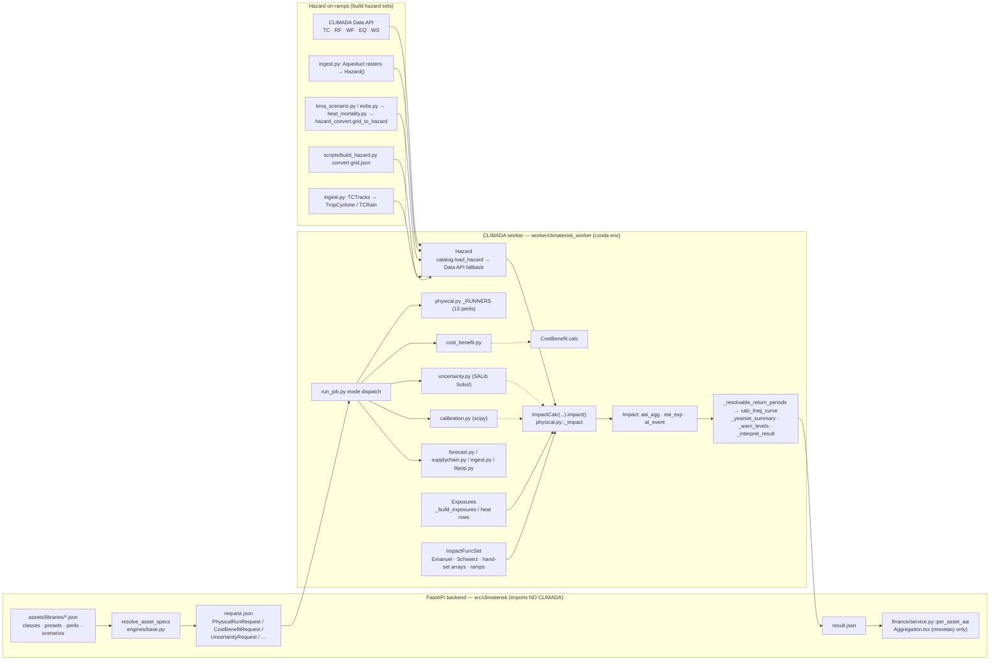

# CLIMADA methods in climaterisk — what is native, what is custom, what is missing

**Audit date:** 2026-09-07 · **Code state:** branch `docs/climada-gap-analysis`, commit `f8d0bb4`
(worker code identical to `main`) · **CLIMADA pinned:** `climada>=6.1`, `climada_petals>=6.1`
(`worker/climaterisk_worker/env_climada.yml`).

This document is a **methodology audit**, not a feature list. It answers one question per
component: *does climaterisk call CLIMADA here, wrap it, replace it, or not implement it?*
The **code is the reference for facts**; existing docs are audited against it in the final
section. Where a claim rests on CLIMADA-library behaviour rather than repository code, it is
tied to a CLIMADA source (docs, paper, or module) so a reader can check it. No calculation
logic was changed for this audit.

Every component carries one tag:

| Tag | Meaning |
|---|---|
| `[CLIMADA NATIVE]` | A CLIMADA / climada_petals class or function is called and its result is used as-is |
| `[CLIMATERISK CUSTOM]` | Logic written in this repository (may *feed* CLIMADA objects, but the method is ours) |
| `[EXTERNAL]` | Data or model produced outside both (Data API sets, ISIMIP, Aqueduct, KMA, E-OBS, NGFS…) |
| `[PARTIAL]` | CLIMADA is used for part of the step; the rest is custom, missing, or single-peril |
| `[NOT IMPLEMENTED]` | Absent from the code path |

Path abbreviations: `P` = `worker/climaterisk_worker/physical.py`; other worker modules by
file name; `BASE` = `src/climaterisk/engines/base.py`; `IFJ` = `assets/libraries/impact_functions.json`.
`P:nnn` line numbers refer to commit `f8d0bb4` (the audited state); the post-audit fixes below
moved some lines — use the function names.

---

## Post-audit code fixes (2026-09-07)

The audit's Critical/High findings were fixed at code level with the smallest change that
removes the finding, **without adding any new curve, parameter or scientific assumption**:
every substituted value is a preset CLIMADA itself ships, selected by CLIMADA's own
country-to-region tables. Status vocabulary used from here on:

| Status | Meaning |
|---|---|
| **Implemented** | end-to-end code path exists and is exercised by a test that runs in the backend env |
| **Partial** | code path exists with a stated limitation (e.g. one peril) |
| **Framework only** | interfaces/metrics exist; no real data has been through them |
| **Not validated** | feature works but has not been compared to observed data |
| **Not implemented** | no code |

| Domain | Before (audit) | After (this change) | Status |
|---|---|---|---|
| TC vulnerability | class `v_half` 70–110 for every country; Eberenz presets opt-in | default = bundled Eberenz regional preset by asset ISO3 (KOR → WP4 190.5); class value only as fallback or on `options.tc_impf_default="class"`; explicit studio overrides never replaced (`vulnerability.resolve_tc_vhalf`, used by physical/cost-benefit/uncertainty/forecast/supply-chain) | **Implemented** (test: `tests/test_vulnerability_defaults.py`), **Not validated** against Korean losses |
| Flood vulnerability | JRC-Europe-like class curve everywhere | default = bundled JRC regional residential preset by asset ISO3 (KOR → Asia, DEU → Europe); unsupported country → generic class curve, reported as such (`vulnerability.resolve_flood_mdr`; river, coastal, surge share `_flood_impf_set`) | **Implemented**, **Not validated** |
| Heat scenario | `heat_mortality` queried `historical` only; KMA SSP layers unreachable; Korean `heatwave` layer stamped `HM` vs runner `HW` | requested scenario first, `historical` fallback reported in `detail` (`_resolve_heat_hazard`); `HEATWAVE_HAZ_TYPE` shared by runner and `scripts/heat_korea.py` | **Implemented** (resolver test CLIMADA-free; request → SSP layer → ImpactCalc test in `test_kma_scenario.py` needs CLIMADA) |
| CostBenefit | `request["peril"]` ignored, TC computed silently; no computation test | `peril` honoured: TC computed, any other peril → structured `status="error"` before CLIMADA import; TC computation test on a synthetic hazard (CLIMADA-gated) | **Partial** (TC only, by design and now explicit) |
| Calibration | result displayed only; no metadata; not consumed | record with provenance (source, period, objective, method, bounds, hazard, timestamp, schema) persisted to `data/calibrations/`; consumed when `options.tc_impf_default="calibrated"`; `fit_status="fitted"` | **Implemented** persistence/application; fit method unchanged; **Not validated** |
| Uncertainty | SALib Sobol, TC only, uncited bounds, unseeded, described as "unsequa" in places | same method, now seeded (`_SOBOL_SEED`, `request["seed"]`), bounds labelled *indicative assumption* in code, result and UI; scope/method/bounds returned in the result; `unsequa` wording removed | **Partial** (TC only; bounds still assumptions) |
| Validation | none beyond regression baselines and the Spain heat ranking | `validation.py`: observed-vs-modelled annual/event metrics (bias, MAE, RMSE, ratio, coverage) + observed-series contract; arithmetic tested on synthetic numbers only | **Framework only** — no observed Korean series wired |
| Korean localization | on-ramps tested on synthetic files; regional presets not applied; heat SSP unreachable | KOR now receives Eberenz WP4 / JRC Asia by default; KMA SSP mortality layers resolvable; `tcrain` ingester reachable from the API | **Partial** — still **no real KMA / 홍수위험지도 / 재해연보 data executed** |
| Wildfire | historical only, no ignition threshold (documented) | unchanged; runner docstring now states historical-only + indicative sigmoid | **Partial** (no code change) |
| TCRain ingest | worker refiner blocked by API whitelist | `INGEST_SOURCES` includes `tcrain`; whitelist == Data tab == worker refiners (tested) | **Implemented** |

Follow-up (2026-09-09): the heat-mortality **adaptation assumption** was decided and
implemented — future scenario windows inherit the baseline comfort band (no adaptation as the
reference case) and adaptation is an explicit absolute threshold shift, following the Korean
scenario set of Lee et al. (2019). Rationale, the six papers behind it and what remains:
`docs/HEAT_ADAPTATION_KR.md`.

Environment note: CLIMADA is not installable on the audit machine (no conda), so tests marked
`importorskip("climada")` are **blocked by environment** here, not passing — they are written to
run in `./.climada-env`.

---

## Table of contents

1. [Purpose and Scope](#1-purpose-and-scope)
2. [What CLIMADA Is](#2-what-climada-is)
3. [Core CLIMADA Methodology](#3-core-climada-methodology)
4. [climaterisk Implementation](#4-climaterisk-implementation)
5. [Peril-specific Methodology](#5-peril-specific-methodology)
6. [Future Climate Methodology](#6-future-climate-methodology)
7. [Uncertainty Methodology](#7-uncertainty-methodology)
8. [Calibration Methodology](#8-calibration-methodology)
9. [Adaptation and Cost-Benefit](#9-adaptation-and-cost-benefit)
10. [Validation](#10-validation)
11. [Data Provenance](#11-data-provenance)
12. [CLIMADA Coverage Matrix](#12-climada-coverage-matrix)
13. [Known Gaps](#13-known-gaps)
14. [Recommended Roadmap](#14-recommended-roadmap)
- [Documentation Consistency Audit](#documentation-consistency-audit)

---

## 1. Purpose and Scope

**Purpose.** Give a reader with CLIMADA background an exact account of how climaterisk uses
CLIMADA, so that (a) results are not over-attributed to CLIMADA, (b) custom logic is visible and
reviewable, and (c) the gap between "the framework can" and "this platform does" is explicit.

**In scope.** The physical-risk worker (`worker/climaterisk_worker/`), the request/result
contract (`src/climaterisk/engines/base.py`), the bundled vulnerability libraries
(`assets/libraries/`), the hazard-building scripts (`scripts/build_hazard.py`,
`scripts/heat_korea.py`, `scripts/heatwave_europe.py`, `scripts/build_impf_presets.py`), and the
backend/frontend aggregation of worker outputs.

**Out of scope.** Transition risk (`src/climaterisk/transition/`, NGFS carbon-price
passthrough) and the finance chain (`src/climaterisk/finance/`) are platform-native and use no
CLIMADA; they are mentioned only where they consume CLIMADA outputs (§4.6).

**Method.** Static reading of the code at `f8d0bb4`, cross-checked by three independent code
traces (pipeline, uncertainty/calibration/adaptation, scenario/return-period/heat). The CLIMADA
conda env is **not installed** on the audit machine, so nothing was executed; statements about
CLIMADA-internal behaviour are marked as sourced from CLIMADA documentation rather than from a run.

**Principles applied.**
1. Code is the fact base. Where docs and code disagree, the doc is listed for correction.
2. Official CLIMADA documentation and papers are the reference axis for "what CLIMADA is".
3. Every component is tagged; "supported" is never written where "partially implemented" is true.

---

## 2. What CLIMADA Is

### 2.1 A probabilistic, event-based risk framework

CLIMADA (CLIMate ADAptation) is an open-source Python framework from ETH Zürich for
probabilistic natural-hazard risk assessment and adaptation appraisal (GPL-3.0). Its core model is

> **Risk = Hazard × Exposure × Vulnerability**, evaluated **event by event** over a
> probabilistic event set, each event carrying an annual **frequency**.

For one event *e* and one exposure point *i*:

```
impact[e, i] = exposure_value[i] × MDD(intensity[e, i]) × PAA(intensity[e, i]) × fraction[e, i]
```

where MDD is the *mean damage degree* and PAA the *percentage of affected assets* of the
impact function assigned to that exposure point. Aggregations follow: `at_event[e] = Σ_i`,
`eai_exp[i] = Σ_e frequency[e] × impact[e, i]`, `aai_agg = Σ_i eai_exp[i]`, and the exceedance
frequency curve derived from `(at_event, frequency)`.

Primary sources: Aznar-Siguan & Bresch (2019), *CLIMADA v1: a global weather and climate risk
assessment platform*, GMD 12, 3085–3097, doi:10.5194/gmd-12-3085-2019; documentation at
<https://climada-python.readthedocs.io/>. The adaptation-economics extension is described in
Bresch & Aznar-Siguan (2021), *CLIMADA v1.4.1: towards a globally consistent adaptation options
appraisal tool*, GMD 14, 351–363, doi:10.5194/gmd-14-351-2021.

### 2.2 What CLIMADA is not

- **Not a climate model.** It does not simulate the atmosphere or ocean. Future hazard comes
  from external projections (GCM/RCM-driven hazard sets, statistical scaling such as Knutson-type
  frequency factors) that are *loaded into* a `Hazard`.
- **Not a downscaler.** Hazard resolution is whatever the hazard set carries.
- **Not a hydrodynamic or structural engine.** The petals `TCSurgeBathtub` is an explicit
  bathtub (no dynamics, no defences); flood depth sets are consumed, not computed.
- **Not a financial model.** It stops at impact, frequency curves, and cost–benefit of
  measures; NPV/DSCR/rating logic is outside it.
- **Not a calibrated vulnerability library for every region.** It ships published *forms*
  (Emanuel TC, Schwierz/Welker windstorm, JRC flood, Eberenz regional TC) and a calibration
  toolkit (`climada.util.calibrate`); choosing and validating curves is the user's job.

### 2.3 Climate model vs hazard model vs risk model

| Layer | Produces | Examples relevant here | Who owns it |
|---|---|---|---|
| **Climate model** | Physical climate fields under a forcing scenario | CMIP6 GCMs, CORDEX RCMs, KMA 남한상세 5-RCM ensemble, ISIMIP driving data | `[EXTERNAL]` |
| **Hazard model** | Event sets with intensity, footprint, frequency | IBTrACS synthetic TC tracks → `TropCyclone` wind fields; ISIMIP river-flood depth; WISC/CMIP6 windstorm gusts; Aqueduct return-period depth rasters; E-OBS/KMA summer Tmax → degree-days | CLIMADA Data API `[EXTERNAL]`, climada_petals `[CLIMADA NATIVE]`, or climaterisk `[CLIMATERISK CUSTOM]` |
| **Risk model** | Impact per event/asset, AAI, exceedance curves, measure benefits | `ImpactCalc`, `Impact.calc_freq_curve`, `CostBenefit` | `[CLIMADA NATIVE]` |

climaterisk sits almost entirely in the **risk-model** layer plus **hazard-set assembly**
for perils the Data API lacks. It contains no climate model, and every future-scenario claim
in the platform must be traced to an external hazard set (§6).

---

## 3. Core CLIMADA Methodology

Sourced from the CLIMADA documentation (v6 API reference and tutorials) unless a repo line is
cited.

### 3.1 Hazard

`climada.hazard.Hazard`: `haz_type` tag (e.g. `TC`, `RF`, `WS`, `EQ`, `WFseason`),
`centroids` (`Centroids`, lat/lon), sparse `intensity[event, centroid]` with `units`,
`fraction[event, centroid]` (share of the cell affected; defaults to 1 where intensity>0),
`frequency[event]` (per year), `event_id`, `event_name`, `date`. Constructors used by this repo:
`Hazard.from_hdf5`, `TropCyclone.from_tracks`, `TCTracks.from_ibtracs_netcdf` →
`calc_perturbed_trajectories`, petals `TCSurgeBathtub.from_tc_winds`, `TCRain.from_tracks`,
`TCForecast`, and the generic `Hazard(...)` constructor. Climate scaling for TC (CLIMADA ≥ 6.0):
`TropCyclone.apply_climate_scenario_knu(percentile="50", scenario, target_year, yearly_steps)`
rescales **event frequency only**, using Knutson et al. (2020, BAMS 101, E303–E322) basin
projections converted to per-year RCP factors after Jewson (2021); the frequency-only choice
follows Jewson (2022). `TropCyclone.from_tracks` assigns `frequency = 1 / (n_years × ensemble
size)` from the track set's year span (CLIMADA TropCyclone tutorial).

### 3.2 Exposure

`climada.entity.Exposures`: a GeoDataFrame with `latitude`, `longitude`, `value`, optional
`value_unit`, and per-hazard impact-function id columns `impf_<HAZ_TYPE>` (fallback column
`impf_`). Centroid assignment (`assign_centroids`) links each point to its nearest hazard
centroid within a distance threshold. Modelled exposure generators: `LitPop.from_countries`
(nightlight × population; Eberenz et al. 2020, ESSD 12, 817–833), petals `BlackMarble`,
`GDP2Asset`, `CropProduction`, `Exposures.from_raster`; OSM buildings via `osm_flex`.

### 3.3 Vulnerability / impact functions

`climada.entity.ImpactFunc` (`haz_type`, `id`, `intensity`, `mdd`, `paa`, `intensity_unit`)
collected in an `ImpactFuncSet`. Published forms shipped by CLIMADA:
`ImpfTropCyclone.from_emanuel_usa(v_thresh=25.7, v_half=74.7, scale=1)` (Emanuel 2011),
`ImpfSetTropCyclone.calibrated_regional_vhalf(approach, q)` (Eberenz et al. 2021, NHESS 21,
393–415, doi:10.5194/nhess-21-393-2021), `ImpfStormEurope.from_schwierz()` / `.from_welker()`
(Schwierz et al. 2010; Welker et al. 2021), petals `ImpfRiverFlood.from_jrc_region_sector`
(Huizinga et al. 2017, JRC105688), `ImpactFunc.from_sigmoid_impf`, and the wildfire form of
Lüthi et al. (2021, GMD 14, 7175–7187).

### 3.4 ImpactCalc / Impact

`climada.engine.ImpactCalc(exposures, impfset, hazard).impact(save_mat, assign_centroids)`
returns an `Impact` with `imp_mat` (if saved), `at_event`, `eai_exp`, `aai_agg`, `frequency`,
`event_id`, `date`, `coord_exp`, `tot_value`, `unit`.

### 3.5 Risk metrics

`Impact.aai_agg` (average annual impact), `Impact.eai_exp` (expected annual impact per
exposure point), `Impact.at_event`, `Impact.calc_freq_curve(return_per)` → `ImpactFreqCurve`
(`return_per`, `impact`), `climada.util.yearsets.impact_yearset` (Poisson-sample events into
years to obtain an annual-loss distribution), `Impact.local_exceedance_impact`.

### 3.6 Adaptation

`climada.entity.Measure` (`hazard_set`, `hazard_freq_cutoff`, `hazard_inten_imp`,
`mdd_impact`, `paa_impact`, `imp_fun_map`, `exposures_set`, `risk_transf_attach`,
`risk_transf_cover`, `cost`), `MeasureSet`, `DiscRates`, `Entity`;
`climada.engine.CostBenefit.calc(hazard, entity, haz_future, ent_future, future_year,
risk_func, imp_time_depen, save_imp)` → `benefit`, `cost_ben_ratio`, `tot_climate_risk`,
`imp_meas_present/future`. Documented in Bresch & Aznar-Siguan (2021).

### 3.7 Frequency curves and return periods

`Impact.calc_freq_curve(return_per=None)` sorts `at_event`, accumulates `frequency` into
exceedance frequency, converts to return period, and interpolates impact onto the requested
return periods (`numpy.interp`, which holds the end value — constant extrapolation — beyond the
observed range). **CLIMADA itself imposes no validity cap** relative to record length; any cap
is the caller's responsibility (§4.5, §5.x "Return period" rows).

Also relevant but **not used** by climaterisk: `climada.engine.unsequa` (`InputVar`,
`CalcImpact`, `CalcDeltaImpact`, `CalcCostBenefit`, `UncOutput`; Kropf et al. 2022, GMD 15,
7177–7201, doi:10.5194/gmd-15-7177-2022) and `climada.util.calibrate` (`Input`,
`ScipyMinimizeOptimizer`, `BayesianOptimizer`, `OutputEvaluator`).

---

## 4. climaterisk Implementation

### 4.1 Architecture



Differences from the generic CLIMADA picture: (1) two processes with a JSON contract and a
GPL boundary (`tests/test_gpl_boundary.py`); (2) uncertainty (**U**) does *not* wrap the
impact calc through `unsequa` but re-invokes `ImpactCalc` from a SALib sample; (3) adaptation
(**A**) is a separate run mode, not a modifier on the main impact path; (4) future climate
(**F**) is not a transformation applied inside the worker but a *choice of hazard set*
(catalog key or Data API property), with one native exception (Knutson scaling, opt-in).

### 4.2 Hazard sources

| Resolution order | Code | Tag |
|---|---|---|
| 1. Local catalog `data/hazard_db/catalog.json` keyed `(peril, climate_scenario, region, year)`, nearest year | `catalog.py::load_hazard` → `Hazard.from_hdf5` | `[CLIMATERISK CUSTOM]` index, `[CLIMADA NATIVE]` loader |
| 2. CLIMADA Data API (`Client().get_hazard`, one retry after cache purge) | `_dataapi.py::resilient_get_hazard` | `[CLIMADA NATIVE]` client, `[EXTERNAL]` data |
| 3. Native hazard derivation at run time | `TCSurgeBathtub.from_tc_winds` (P:906), `apply_climate_scenario_knu` (P:402) | `[CLIMADA NATIVE]` |

Hazards are cropped to the asset bounding box ± 2° before impact (`P:262-292`,
`Hazard.select(extent=…)`) — a performance step that keeps every event and frequency.

Catalog builders: `hazard_convert.grid_to_hazard` (standardized grid → `Hazard`,
`frequency = 1/n_years`, `fraction = intensity > 0`; `hazard_convert.py:54-94`),
`ingest.py` refiners `dataapi`, `aqueduct`, `copdem`, `tctracks`, `tcrain`
(`ingest.py:559-565`). Hail, landslide, drought, crop_yield and low_flow have **no ingester**;
they require a hand-supplied `grid.json`.

### 4.3 Exposures

- **User assets** → `Exposures(pd.DataFrame({latitude, longitude, value, impf_<HT>}), value_unit=first asset's currency)` (`P:167-206`). Footprint assets (GeoJSON) are disaggregated to ≤64 interior grid points with value split evenly (`P:129-164`) and re-aggregated per asset from `eai_exp` (`P:209-217`). `[PARTIAL]` — CLIMADA object, custom fill.
- **Modelled exposures** (`exposures.py`, `litpop.py`): `LitPop.from_countries`, petals `BlackMarble`, `GDP2Asset`, OSM buildings via `osm_flex`, and a WorldPop/GHSL raster path that reads the GeoTIFF with `rasterio`, block-sums it and builds `Exposures(DataFrame)` (`exposures.py:202-256`; the library label says `Exposures.from_raster`, but that method is not called). The `crop` source always raises `ExposureUnavailable` (`exposures.py:321-322`), so 6 of the "7 sources" can produce an exposure. Grid cells become asset dicts stamped with `_DEFAULT_VULN` (`litpop.py:18-25`; TC `v_half=74.7`, which differs from the JSON residential default 70.0 and from the calibration fallback 84.7). Population grids carry `headcount` with `value=0` so people are never priced (`RISK_REGISTER A13`). `[CLIMADA NATIVE]` generators, `[CLIMATERISK CUSTOM]` conversion.
- **Heat mortality** builds its own two-rows-per-site exposure in persons (§5.8).

### 4.4 Vulnerability resolution

`resolve_asset_specs` (`BASE:47-88`) maps each asset to a class in `IFJ` (or the sector's
default class), applies session overrides, and ships concrete numbers in `AssetSpec`:
`tc_v_half`, `wf_max_mdd`, `flood_depth_m` + `flood_mdr`, `eq_mmi` + `eq_mdr`. Class defaults
(`IFJ`): TC `v_half` 70 / 80 / 88 / 100 / 110 m/s for residential … infrastructure;
`wf_max_mdd` 0.40 … 0.20; flood residential `[0, .25, .40, .60, .75, .85, .92, .95]` at
depths `[0, .5, 1, 2, 3, 4, 5, 6]` m; EQ MDR at MMI 5–10.

Published presets (`assets/libraries/impact_function_presets.json`, 21 entries) are baked
**offline** by `scripts/build_impf_presets.py` using `ImpfSetTropCyclone.calibrated_regional_vhalf(q=0.5)`
(Eberenz 2021, 10 regions + USA default; e.g. WP4 North-West Pacific `v_half=190.5`) and
`ImpfRiverFlood.from_jrc_region_sector(region, "residential")` (6 regions); EQ presets are
labelled indicative. **Geography-aware preset selection (2026-09-07).** The worker replaces an *inherited class
default* with the bundled regional preset when the asset's ISO3 (from `_per_asset_iso3`) is
listed on a preset (`worker/climaterisk_worker/vulnerability.py`):

| Precedence | TC `v_half` | Flood `flood_mdr` |
|---|---|---|
| 1 explicit studio override (`AssetSpec.explicit_params`) | kept | kept |
| 2 persisted calibration (`options.tc_impf_default="calibrated"` only) | `data/calibrations/tropical_cyclone_v_half_<ISO3>.json` | — |
| 3 **regional preset** (default mode `"regional"`) | Eberenz region from CLIMADA `get_countries_per_region` (e.g. KOR/JPN/TWN/HKG/MAC → WP4 190.5, USA/CAN → NA2 89.2, DEU → ROW 110.1) | JRC region from CLIMADA `NatRegIDs.csv` (e.g. KOR → Asia, DEU → Europe, MEX → South America) |
| 4 **generic fallback** (mode `"class"`, unknown country, or depth breakpoints ≠ preset) | class value from `IFJ` | class curve from `IFJ` |

Every result `detail` names the source used per asset count (e.g. `TC v_half [regional]:
Eberenz WP4 preset v_half 190.5 (3 assets)`), so a *regional vulnerability preset* is never
confused with the *generic fallback curve*. Membership lists live on each preset as
`countries` (added by `scripts/build_impf_presets.py` from CLIMADA's tables).
`[CLIMADA NATIVE]` values and membership, `[CLIMATERISK CUSTOM]` selection logic.

The worker then constructs `ImpactFunc` objects from these numbers: Emanuel form for TC
(`ImpfTropCyclone.from_emanuel_usa`), Schwierz/Welker for windstorm (native, class ignored),
sigmoid for wildfire (`ImpactFunc.from_sigmoid_impf`, `k=0.035`, `x0=325 K` hard-coded), and
plain `ImpactFunc(intensity, mdd, paa=1)` arrays for flood/coastal/surge/EQ and the seven
catalog ramps.

### 4.5 Impact calculation

Single call site: `P:295-301`

```python
haz = _crop_hazard(haz, exp.latitude, exp.longitude)
imp = ImpactCalc(exp, impf_set, haz).impact(save_mat=True, assign_centroids=True)
imp._warn = _warn_levels(haz, exp)
```

`[CLIMADA NATIVE]`. `imp_mat` is saved but never read in `physical.py` (it is used by
`supplychain.py`). Every runner then applies the same post-processing:

| Step | Code | Tag |
|---|---|---|
| Return-period cap | `_resolvable_return_periods(imp)` (`P:44-83`): `record_years = 1/min(frequency)`, `max_rp = 0.5 × record_years`, drop requested RPs above it (never empty: the shortest requested RP survives) | `[CLIMATERISK CUSTOM]` guardrail |
| Frequency curve | `imp.calc_freq_curve(_rps)` on the kept RPs; `return_per`/`impact` passed through unmodified | `[CLIMADA NATIVE]` |
| Annual-loss distribution | `_yearset_summary` → `impact_yearset(imp, sampled_years=1..100, seed=1789)` → mean/P50/P90/P95/P99/max | `[CLIMADA NATIVE]` sampler, custom summary |
| Warn bands | `_warn_levels` → petals `Warn.bin_map` on per-asset max intensity with quantile thresholds | `[PARTIAL]` |
| Present→future delta | `(future_aai − present_aai)/present_aai × 100` where both runs exist | `[CLIMATERISK CUSTOM]` |
| Interpretation | `_interpret_result` distinguishes error / outside footprint / below threshold / non-zero | `[CLIMATERISK CUSTOM]` |

### 4.6 Aggregation

- Per asset: `eai_exp` summed back to source asset (footprints) — `P:209-217`.
- Per portfolio: `aai_agg` per peril from CLIMADA; **across perils** summed in the backend
  (`finance/service.py::per_asset_aai`, monetary results only) and in the UI
  (`frontend/climaterisk/src/components/Aggregation.tsx`, grouped by sector and by ISO3
  country). Cross-peril summation is **independent addition** — no event-level combination of
  sub-perils (TC wind + surge + rain are separate perils; GAP G5). `[CLIMATERISK CUSTOM]`.
- Non-monetary results (`result_kind` = `mortality`, `productivity`, `yield`) are excluded
  from currency totals (`tests/test_heat_mortality.py::test_non_monetary_perils_excluded_from_financial_aai`).
- National view: grouping by asset country; no CLIMADA national aggregation is involved.

---

## 5. Peril-specific Methodology

Row template: Hazard source · Hazard type · Hazard representation · Exposure · Impact function ·
CLIMADA component · Custom component · Main risk metric · Future scenario · Calibration ·
Uncertainty · Adaptation · Validation · Status · Main gap.

### 5.1 Tropical cyclone (`tropical_cyclone`) — `P:343-441`

| Row | Content | Tag |
|---|---|---|
| Hazard source | Local catalog first; else CLIMADA Data API `tropical_cyclone` (`event_type=synthetic`, `model_name=random_walk`, per-country then global) | `[EXTERNAL]` via `[CLIMADA NATIVE]` client |
| Hazard type | `TC`, 1-min sustained wind m/s | — |
| Hazard representation | Probabilistic synthetic-track event set (IBTrACS-derived random-walk perturbations); frequencies as delivered. The optional `ingest_tctracks` on-ramp (IBTrACS 2010–2021, `nb_synth_tracks=2`) sets no frequency itself and relies on `TropCyclone.from_tracks`' native `1/(n_years × 3)` | `[EXTERNAL]` / `[CLIMADA NATIVE]` |
| Exposure | User points/footprints → `Exposures`, `impf_TC` | `[PARTIAL]` |
| Impact function | `ImpfTropCyclone.from_emanuel_usa(v_half=…)` (`v_thresh` left at CLIMADA's 25.7 m/s); `v_half` = explicit override → (opt-in) persisted calibration → **Eberenz regional preset by ISO3** (default) → class value (fallback); one function per distinct `v_half` (`vulnerability.resolve_tc_vhalf`) | `[CLIMADA NATIVE]` form and preset values; `[CLIMATERISK CUSTOM]` selection |
| CLIMADA component | `ImpactCalc`, `calc_freq_curve`, `impact_yearset`, `apply_climate_scenario_knu` (opt-in) | `[CLIMADA NATIVE]` |
| Custom component | Hazard resolution order, RP cap, delta %, footprint split, warn thresholds | `[CLIMATERISK CUSTOM]` |
| Main risk metric | Future `aai_agg`, per-asset `eai`, RP curve (10–250 yr as supported), yearset, `delta_pct` | — |
| Future scenario | `ref_year = nearest(2040/2060/2080, max(anchor_years))`; future = catalog → Data API `rcp×ref_year` → Knutson scaling if `options.tc_future_method=="knutson"`. Present = Data API `climate_scenario="None"` (always Data API, even when future is catalog) | `[EXTERNAL]` / `[CLIMADA NATIVE]` |
| Calibration | Runner exists (§8) — TC `v_half` vs EM-DAT; result persisted with provenance and applied when `options.tc_impf_default="calibrated"`; not yet run on Korean data | `[PARTIAL]`, not validated |
| Uncertainty | Sobol over exposure value / `v_half` / frequency (§7) — TC only | `[CLIMATERISK CUSTOM]` |
| Adaptation | `CostBenefit` runner (§9) — TC only | `[CLIMADA NATIVE]` engine |
| Validation | `tests/test_physical_regression.py` (3 tests: AAI, EAI, RP curve vs stored baseline; requires CLIMADA). No observed-loss validation in repo | `[PARTIAL]` |
| Status | Most complete peril: native hazard, native form, delta, uncertainty, adaptation, calibration hook | — |
| Main gap | (G1 fixed in code 2026-09-07: KOR defaults to WP4 190.5.) Remaining: the regional preset is a single TDR-optimised point (no RMSF↔TDR band, G6); no Korean observed-loss validation of the default (RISK_REGISTER C2/C5) | High |

### 5.2 River flood (`river_flood`) — `P:444-538`

| Row | Content | Tag |
|---|---|---|
| Hazard source | Catalog first; else Data API `river_flood` (`climate_scenario`, `year_range`; per-country then global). Catalog may hold Aqueduct-ingested layers | `[EXTERNAL]` |
| Hazard type | `RF`, inundation depth m | — |
| Hazard representation | Data API: ISIMIP-derived depth per event. Aqueduct path: 8 return-period layers (5–1000 yr) as 8 events with incremental frequency `1/rp_i − 1/rp_{i+1}` (`ingest.py:139-146`), single GCM `NorESM1-M` | `[EXTERNAL]` / `[CLIMATERISK CUSTOM]` |
| Exposure | `Exposures`, `impf_RF` | `[PARTIAL]` |
| Impact function | `ImpactFunc(haz_type="RF", intensity=flood_depth_m, mdd=…, paa=1)` built by `_flood_impf_set`; `mdd` = explicit override → **JRC regional residential preset by ISO3** (default; KOR → Asia) → class curve (generic fallback, JRC-Europe-like `[0,.25,.40,.60,.75,.85,.92,.95]`). Preset values baked offline from petals `ImpfRiverFlood.from_jrc_region_sector` | `[CLIMADA NATIVE]` preset values; `[CLIMATERISK CUSTOM]` selection + fallback arrays |
| CLIMADA component | `ImpactCalc`, `calc_freq_curve`, `impact_yearset` | `[CLIMADA NATIVE]` |
| Custom component | Scenario remap `rcp45→rcp60` (`_params.py`), year-range snapping, Aqueduct frequency model | `[CLIMATERISK CUSTOM]` |
| Main risk metric | Future `aai_agg`, `eai`, RP curve, yearset, `delta_pct` vs Data API `historical/1980_2000` | — |
| Future scenario | Data API `rcp × year_range` (window containing `max(anchor_years)`, default `2030_2050`) | `[EXTERNAL]` |
| Calibration | None; 6 JRC continental presets opt-in | `[NOT IMPLEMENTED]` |
| Uncertainty | None (Sobol is TC-only) | `[NOT IMPLEMENTED]` |
| Adaptation | None (CostBenefit is TC-only) | `[NOT IMPLEMENTED]` |
| Validation | None in repo | `[NOT IMPLEMENTED]` |
| Status | Native hazard, native engine, custom depth-damage arrays | — |
| Main gap | (G2 fixed in code 2026-09-07: KOR defaults to JRC Asia residential.) Remaining: residential sector only (no per-sector JRC curve); point assets near rivers fall outside ISIMIP footprints (B1); no Korean validation | Medium |

### 5.3 Wildfire (`wildfire`) — `P:541-608`

| Row | Content | Tag |
|---|---|---|
| Hazard source | Catalog `("wildfire","historical",iso3,2020)`; else Data API `wildfire` per country. Single-country portfolios only | `[EXTERNAL]` |
| Hazard type | `WFseason`, brightness temperature K | — |
| Hazard representation | Historical fire seasons as events (Data API) | `[EXTERNAL]` |
| Exposure | `Exposures`, `impf_WFseason` | `[PARTIAL]` |
| Impact function | `ImpactFunc.from_sigmoid_impf(intensity=(295,500,5), L=wf_max_mdd, k=0.035, x0=325)` — constructor native, parameters hard-coded in `P:572`; petals `ImpfWildfire` deliberately avoided (comment: broken in petals 6.2) | `[PARTIAL]` |
| CLIMADA component | `ImpactCalc`, `calc_freq_curve`, `impact_yearset` | `[CLIMADA NATIVE]` |
| Custom component | Sigmoid parameters; no ignition threshold | `[CLIMATERISK CUSTOM]` |
| Main risk metric | `aai_agg`, `eai`, RP curve (record ≈ n seasons → cap ≈ half), yearset | — |
| Future scenario | **None** — historical only; `present_aai_agg=None`, `delta_pct=None` | `[NOT IMPLEMENTED]` |
| Calibration | None; Lüthi et al. (2021) calibrated form not applied | `[NOT IMPLEMENTED]` |
| Uncertainty / Adaptation | None | `[NOT IMPLEMENTED]` |
| Validation | None | `[NOT IMPLEMENTED]` |
| Status | Native hazard + engine; indicative vulnerability | — |
| Main gap | Sigmoid from 295 K without threshold overstates low-intensity seasons (GAP G3); no future set | High |

### 5.4 European windstorm (`european_windstorm`) — `P:611-695`

| Row | Content | Tag |
|---|---|---|
| Hazard source | Data API **only** (no catalog): `storm_europe`, `data_source=CMIP6`, `spatial_coverage=Europe`, `climate_scenario=ssp*`; **first** listed GCM dataset taken | `[EXTERNAL]` |
| Hazard type | `WS`, gust m/s | — |
| Hazard representation | CMIP6-driven winter-storm event set | `[EXTERNAL]` |
| Exposure | `Exposures`, `impf_WS=1` for every asset — vulnerability class ignored | `[PARTIAL]` |
| Impact function | `ImpfStormEurope.from_schwierz()` default, `.from_welker()` via `options.windstorm_impf` | `[CLIMADA NATIVE]` calibrated |
| CLIMADA component | `ImpactCalc`, `calc_freq_curve`, `impact_yearset`, `Client.list_dataset_infos` | `[CLIMADA NATIVE]` |
| Custom component | RCP→SSP map (`rcp26→ssp126 … rcp85→ssp585`, default `ssp585`), first-GCM choice | `[CLIMATERISK CUSTOM]` |
| Main risk metric | Future `aai_agg`, `eai`, RP curve, yearset, `delta_pct` vs `climate_scenario="None"` CMIP6 set (best-effort) | — |
| Future scenario | Data API SSP set; `target_year=None` (dataset-defined horizon) | `[EXTERNAL]` |
| Calibration | Curves are published-calibrated (Schwierz, Welker) — the only peril with a calibrated default | `[CLIMADA NATIVE]` |
| Uncertainty / Adaptation | None | `[NOT IMPLEMENTED]` |
| Validation | None in repo | `[NOT IMPLEMENTED]` |
| Status | Fully native hazard + vulnerability | — |
| Main gap | Single GCM, class-agnostic; not relevant to Korea | Medium (Europe only) |

### 5.5 Earthquake (`earthquake`) — `P:698-768`

| Row | Content | Tag |
|---|---|---|
| Hazard source | Catalog `("earthquake","observed",iso3,2020)`; else Data API `earthquake` per country, `event_type=observed` | `[EXTERNAL]` |
| Hazard type | `EQ`, Modified Mercalli Intensity | — |
| Hazard representation | Observed catalogue events, frequencies as delivered | `[EXTERNAL]` |
| Exposure | `Exposures`, `impf_EQ` | `[PARTIAL]` |
| Impact function | Hand-set `ImpactFunc(intensity=eq_mmi from assets[0], mdd=eq_mdr, paa=1)` per class; EMS-98/HAZUS-style **indicative**, no published CLIMADA EQ library | `[CLIMATERISK CUSTOM]` |
| CLIMADA component | `ImpactCalc`, `calc_freq_curve`, `impact_yearset` | `[CLIMADA NATIVE]` |
| Custom component | MMI curves | `[CLIMATERISK CUSTOM]` |
| Main risk metric | `aai_agg`, `eai`, RP curve (record = 1/min freq of observed set), yearset | — |
| Future scenario | Not applicable (geophysical); `delta_pct=None` | by design |
| Calibration / Uncertainty / Adaptation | None | `[NOT IMPLEMENTED]` |
| Validation | None | `[NOT IMPLEMENTED]` |
| Status | Native hazard + engine, indicative vulnerability | — |
| Main gap | Indicative MMI curves labelled as such; no Korean seismic curves | Medium |

### 5.6 Coastal flood (`coastal_flood`) — `P:771-858`

| Row | Content | Tag |
|---|---|---|
| Hazard source | **Catalog only** — WRI Aqueduct coastal layers ingested by `ingest.py::ingest_aqueduct` (`inuncoast_*`, 9 RPs 2–1000 yr, subsidence `wtsub`, SLR percentile token `"0"`); clear error if absent | `[EXTERNAL]` assembled `[CLIMATERISK CUSTOM]` |
| Hazard type | `CF`, inundation depth m | — |
| Hazard representation | Return-period layers as events with incremental frequency; nearest of 2030/2050/2080; `rcp26/45→rcp4p5`, `rcp60/85→rcp8p5` | `[CLIMATERISK CUSTOM]` |
| Exposure | `Exposures`, `impf_CF` | `[PARTIAL]` |
| Impact function | Same `_flood_impf_set` as river flood (JRC regional preset by ISO3, class curve as fallback) | `[CLIMADA NATIVE]` values, `[CLIMATERISK CUSTOM]` selection |
| CLIMADA component | `Hazard()` constructor, `ImpactCalc`, `calc_freq_curve`, `impact_yearset` | `[CLIMADA NATIVE]` |
| Custom component | Whole hazard assembly | `[CLIMATERISK CUSTOM]` |
| Main risk metric | Future `aai_agg`, `eai`, RP curve (record = 1000 yr → cap 500 → all requested RPs kept), `delta_pct` vs catalog `historical` | — |
| Future scenario | Aqueduct projection layers (single GCM) | `[EXTERNAL]` |
| Calibration / Uncertainty / Adaptation | None | `[NOT IMPLEMENTED]` |
| Validation | `tests/test_aqueduct_layers.py` (layer naming/frequency, 4 tests); no loss validation | `[PARTIAL]` |
| Status | Custom hazard on native engine | — |
| Main gap | (G2 fixed: regional JRC preset by default.) "record_years=1000" reflects the largest published RP, not observation length — the cap is not protective here; single GCM | Medium |

### 5.7 Storm surge (`tc_surge`) — `P:861-958`

| Row | Content | Tag |
|---|---|---|
| Hazard source | TC wind set (catalog-first via `cost_benefit._tc_hazard`) + Copernicus DEM (`CLIMATERISK_DEM_PATH` or catalog `dem/portfolio_dem.tif`, ≤250 px decimated) | `[EXTERNAL]` |
| Hazard type | Surge height m (petals type) | — |
| Hazard representation | `TCSurgeBathtub.from_tc_winds(wind, topo_path=dem, add_sea_level_rise=slr)` — bathtub, no hydrodynamics, **no defences**; SLR as a metre offset `options.sea_level_rise_m` | `[CLIMADA NATIVE]` (petals) |
| Exposure | `Exposures`, `impf_<surge type>` | `[PARTIAL]` |
| Impact function | Same `_flood_impf_set` as river flood (JRC regional preset by ISO3, class curve as fallback) | `[CLIMADA NATIVE]` values, `[CLIMATERISK CUSTOM]` selection |
| CLIMADA component | `TCSurgeBathtub`, `ImpactCalc`, `calc_freq_curve`, `impact_yearset` | `[CLIMADA NATIVE]` |
| Custom component | DEM ingestion/decimation, wind cropping | `[CLIMATERISK CUSTOM]` |
| Main risk metric | `aai_agg`, `eai`, RP curve, yearset; **no present baseline** (`present_aai_agg=None`) | — |
| Future scenario | Inherits the TC wind set's scenario/ref_year | `[EXTERNAL]` |
| Calibration / Uncertainty / Adaptation | None | `[NOT IMPLEMENTED]` |
| Validation | `tests/test_tc_surge.py` (2 tests: DEM-missing degradation) | `[PARTIAL]` |
| Status | Native petals hazard on native engine; separate peril | — |
| Main gap | Not event-combined with wind (independent addition across perils, GAP G5); bathtub without seawalls overstates defended coasts | High |

### 5.8 Heat mortality (`heat_mortality`) — `P:1119-1233`, `heat_mortality.py`

**Classification: a `[CLIMATERISK CUSTOM]` peril executed on the CLIMADA engine.** No
`climada` or `climada_petals` heat/UTCI class is imported anywhere in the repo; the hazard,
its intensity definition, the exposure semantics and the dose-response are all authored here.
Only the container classes (`Hazard`, `Exposures`, `ImpactFunc(Set)`) and `ImpactCalc` are CLIMADA.
This is consistent with CLIMADA itself: neither core nor petals ships a heat-mortality hazard
or impact function (the petals heat-index interface for Copernicus seasonal forecasts was moved
out to a separate package in petals 6.1.0 and carries no mortality function). "Heat mortality as
a CLIMADA peril" therefore means "a custom peril built with CLIMADA containers", not a
CLIMADA-standard peril.

| Component | Source | Status |
|---|---|---|
| `ImpactCalc` | CLIMADA | Native |
| `ImpactFunc` / `ImpactFuncSet` container | CLIMADA | Native |
| Heat-mortality vulnerability curve | climaterisk | Custom |
| Age stratification (<65 / ≥65) | climaterisk | Custom |
| Baseline mortality | climaterisk | Indicative — no source identified |
| Heat-onset threshold (band upper edge) | Kim 2020 (KOR, 93rd percentile of the summer daily-mean distribution) | **External** for KOR; extrapolated elsewhere |
| Adaptation slope (MMT vs climate) | Tobías et al. 2021 (0.8 degC per degC) | **External** |
| Band width, β, age split | climaterisk | Indicative — no source identified |
| Future scenario | platform hazard routing (baseline band + explicit `band_shift_c`) | Partial |
| Korean calibration | observed data | Not yet implemented |
| Empirical validation | Korean mortality / loss data | Not validated |

Every constant, its exact value, its location in the code and its provenance class is
inventoried in **`docs/HEAT_MORTALITY_PROVENANCE.md`** (1 external, 2 internal fits, 15
indicative or unknown of 18) and mirrored in code as `heat_mortality.PARAMETER_PROVENANCE`;
the runner returns it as `parameter_status` and the Results card displays it.

| Row | Content | Tag |
|---|---|---|
| Hazard source | **Catalog only**, key `("heat_mortality", <requested scenario>, region, target)` with a `historical` fallback that is named in `detail` (`_resolve_heat_hazard`, fixed 2026-09-07; previously hard-wired to `historical`). Layers built from E-OBS `tx` (Europe, `eobs.py`), KMA 남한상세 daily TAMAX (`kma_scenario.py`, coarsened 5×5 to 0.05°), or the synthetic season generator | `[EXTERNAL]` data, `[CLIMATERISK CUSTOM]` hazard |
| Hazard type | `HM`, units `degC-days` | custom tag |
| Hazard representation | One event per summer season (Jun–Sep, 122 days); intensity = season exceedance degree-days above the local minimum-mortality comfort band `mmt_high = a + b·mean_Tmax` fitted on 54 hand-set city values; `frequency = 1/n_seasons` | `[CLIMATERISK CUSTOM]` |
| Exposure | Two `Exposures` rows per site (<65 / ≥65), `value = headcount × share`, `value_unit="persons"`; headcount default 250 when missing (stated in `detail`); ≥65 share from override → `COUNTRY_SHARE_OVER65["KOR"]=0.203` → nearest reference city | `[CLIMATERISK CUSTOM]` |
| Impact function | Two custom `ImpactFunc`s: `mdd(D) = min(baseline_daily_mortality × a·D^b, 1)`, `paa=1`; `(a,b)` fitted by `dose_curve` on a **seeded synthetic ensemble** (400 seasons) bridging degree-days to `Σ max(exp(β·ΔT)−1, 0)`; `β` = 0.010 (<65) / 0.034 (≥65), baselines 1.3e-3 and 45e-3 per person-year — no citation in code | `[CLIMATERISK CUSTOM]` |
| CLIMADA component | `ImpactCalc`, `calc_freq_curve` (`P:1196-1199`) | `[CLIMADA NATIVE]` |
| Custom component | Everything else, including `grid_from_summer_tmax`, `standardized_grid`, comfort band, dose curve | `[CLIMATERISK CUSTOM]` |
| Main risk metric | `aai_agg` = expected annual heat-attributable **deaths**; `per_asset.eai` deaths; RP curve (45 E-OBS summers → cap 22.5 yr); `result_kind="mortality"`; **no yearset** (`P:1217`) | — |
| Future scenario | Requested scenario layer when registered (KMA SSP windows filed under `rcp45/rcp85` by `scripts/heat_korea.py` are now resolved), else `historical` with an explicit fallback note; no present→future delta is computed for heat (`present_aai_agg=None`). Tested end-to-end on **synthetic spec-conformant KMA files** (`test_kma_scenario.py`, CLIMADA-gated) — no real KMA file has been run | `[PARTIAL]`, not validated |
| Calibration | Parameters hand-set; dose curve fitted to the model's own synthetic ensemble, not to observed mortality | `[NOT IMPLEMENTED]` (to data) |
| Uncertainty / Adaptation | None | `[NOT IMPLEMENTED]` |
| Validation | Spain: E-OBS observed grid reproduces the 2022/2003 ranking of summers (`tests/test_heat_mortality.py::test_observed_grid_reproduces_the_real_ranking_of_spanish_summers`, skips without E-OBS); extreme years under-predicted ≈2.3× vs MoMo (`docs/HEATWAVE_EUROPE.md`). **No Korean validation** | `[PARTIAL]` (Europe), `[NOT IMPLEMENTED]` (Korea) |
| Status | Custom health peril; Europe comparison reproduces the ranking of observed summers, parameters uncited and uncalibrated (`HEAT_MORTALITY_PROVENANCE.md`) | — |
| Main gap | (Scenario routing fixed.) Dose-response uncalibrated to observed deaths; no present/future delta; Korea unvalidated (no MoMo-equivalent benchmark) | High |

### 5.9 Local hazard catalog perils (`hail`, `landslide`, `tc_rain`, `drought`, `crop_yield`, `low_flow`, `heatwave`) — `P:966-1113`

| Row | Content | Tag |
|---|---|---|
| Hazard source | Catalog only; `landslide/drought/low_flow` forced to `historical`, others take the run scenario. Ingesters exist only for `tc_rain` (`TCRain.from_tracks(model="R-CLIPER")`, petals) and `heatwave` (`heat_korea.py`, `heatwave_europe.py --register`); the other five need a hand-built `grid.json`. The `tcrain` ingester is reachable from the API since 2026-09-07 (`run.py::INGEST_SOURCES`; `tests/test_ingest_sources.py` pins whitelist == Data tab == worker refiners) | `[CLIMATERISK CUSTOM]` / `[CLIMADA NATIVE]` for TCRain |
| Hazard type | `HL` cm, `LS` probability, `TR` mm, `DR` SPEI, `CY` yield-frac, `LF` deficit, `HW` degC | custom tags |
| Hazard representation | Standardized grid → `Hazard` with `frequency=1/n_years` (`hazard_convert.py:89`) | `[CLIMATERISK CUSTOM]` |
| Exposure | `Exposures`, `impf_<HT>` | `[PARTIAL]` |
| Impact function | **Indicative ramps**: fixed breakpoints × fixed shape × the asset's **wildfire** `wf_max_mdd` (`P:1064-1076`) | `[CLIMATERISK CUSTOM]` |
| CLIMADA component | `ImpactCalc`, `calc_freq_curve`, `impact_yearset` | `[CLIMADA NATIVE]` |
| Custom component | Ramps, scenario keys, result kinds (`monetary` / `productivity` / `yield`) | `[CLIMATERISK CUSTOM]` |
| Main risk metric | `aai_agg` in the declared `result_kind`; `metric_unit` set for non-monetary | — |
| Future scenario | Only through catalog key; no present baseline (`delta_pct=None`) | `[PARTIAL]` |
| Calibration / Uncertainty / Adaptation | None | `[NOT IMPLEMENTED]` |
| Validation | `tests/test_catalog_perils.py` (2 tests: ramp construction / ingestion error) | `[PARTIAL]` |
| Status | Engine plumbing complete; vulnerability indicative; honest "needs ingestion" errors | — |
| Main gap | Ramps borrow a wildfire parameter and have no literature basis (GAP G4). (The Korean `heatwave` `haz_type` mismatch `HM`≠`HW` was fixed 2026-09-07 via the shared `HEATWAVE_HAZ_TYPE`.) | Medium |

---

## 6. Future Climate Methodology

### 6.1 Baseline period

There is no single platform baseline. Each runner defines "present" by its hazard source:

| Peril | Present hazard | Code |
|---|---|---|
| TC | Data API `climate_scenario="None"` synthetic set | `P:395` |
| River flood | Data API `historical`, `year_range=1980_2000` | `P:503` |
| Windstorm | Data API CMIP6 `climate_scenario="None"` (best-effort) | `P:649-659` |
| Coastal flood | Catalog `historical` | `P:821` |
| Heat mortality | Catalog `historical` (E-OBS 1980→latest; KMA MK-PRISM 2000–2019 filed as year 2020) | `P:1159`, `heat_korea.py` |
| Wildfire, EQ, surge, catalog perils | No separate present run | — |

### 6.2 Future period

UI offers `anchor_years = [2030, 2040, 2050, 2060]` (`assets/libraries/scenarios.json`). Every
runner **collapses the list to `max(anchor_years)`** and snaps it to what the source offers:
TC → nearest of (2040, 2060, 2080) (`_params.py`); river flood → the ISIMIP window containing
the year, default `2030_2050`; catalog → nearest registered year; Aqueduct → nearest of
(2030, 2050, 2080) at ingest; KMA windows keyed 2030/2050/2070/2090. Intermediate anchor years
have **no effect** on results. `[CLIMATERISK CUSTOM]` selection, `[EXTERNAL]` horizons.

### 6.3 Scenario set (RCP / SSP)

Four ids `rcp26 / rcp45 / rcp60 / rcp85`, remapped per source: river flood `rcp45→rcp60`;
windstorm `→ ssp126/245/370/585`; KMA `→ SSP126/245/370/585`; Aqueduct `rcp26/45→rcp4p5`,
`rcp60/85→rcp8p5`; Knutson `→ "2.6"/"4.5"/"6.0"/"8.5"`. The `warming_c` field in
`scenarios.json` is not consumed by any code path. `[CLIMATERISK CUSTOM]` mapping.

### 6.4 Climate models / ensembles

No multi-model handling exists. TC: Data API random-walk synthetic sets (no GCM choice).
Windstorm: the **first** CMIP6 GCM dataset returned by `list_dataset_infos`. Aqueduct: single
GCM `NorESM1-M`. KMA: 5-RCM ensemble mean (`5ENSMN`), which damps extremes (noted in the
layer's `source` string). `[EXTERNAL]`, `[NOT IMPLEMENTED]` for ensemble spread.

### 6.5 Anchor years, interpolation and extrapolation

- **Linear interpolation between anchor years: `[NOT IMPLEMENTED]`.** The only `np.interp`
  over years in the repo is the ≥65-share demographic multiplier used by the heat CLI
  (`heat_mortality.py:206`) and the discount-rate schedule in `cost_benefit.py`.
- **Present-day baseline blend: `[NOT IMPLEMENTED]`.** Present and future are two independent
  `ImpactCalc` runs; no hazard or loss mixing occurs.
- **Extrapolation:** none in time. The only scaling is the opt-in Knutson/Jewson frequency
  factor (`apply_climate_scenario_knu`, `[CLIMADA NATIVE]`), which rescales `frequency` of the
  present TC set for a given RCP and target year.

### 6.6 Present-to-future change

`delta_pct = (future_aai − present_aai) / present_aai × 100` (`P:416` and siblings) —
`[CLIMATERISK CUSTOM]`, AAI-level, deterministic. `None` for wildfire, earthquake, tc_surge,
catalog perils, heat mortality. The uncertainty module reports an absolute `Y − present_aai`
distribution for TC (§7). **`unsequa.CalcDeltaImpact` is not used.**

Citation note: METHODOLOGY.md cites "Knutson 2020 / Jewson 2021" and the code comment at
`P:392` says "Jewson 2022". Both are defensible for different parts of the method: CLIMADA ≥ 6.0
converts Knutson et al. (2020) basin projections to per-year RCP factors following Jewson
(2021) and applies **frequency changes only** "as suggested by Jewson 2022" (CLIMADA
`tc_clim_change.py` / `TropCyclone.apply_climate_scenario_knu` docstring). The call in `P:402`
uses the v6 signature (`scenario=`, `target_year=`, default `percentile="50"`), so the code is
consistent with the pinned `climada>=6.1`. Docs should cite both papers explicitly.

---

## 7. Uncertainty Methodology

`worker/climaterisk_worker/uncertainty.py::compute_uncertainty` — **`[CLIMATERISK CUSTOM]`**.

### 7.1 Q-A — Is CLIMADA `unsequa` used directly?

**No.** No module imports `climada.engine.unsequa`, `InputVar`, `CalcImpact`,
`CalcDeltaImpact` or `UncOutput`. The words appear only in a docstring (`uncertainty.py:8`),
a comment (`:126`, "CalcDeltaImpact-style"), a UI label, and `docs/METHODOLOGY.md:27`
(incorrect — see audit).

### 7.2 Q-B — Custom wrapper structure

```
SALib.sample.sobol.sample(_PROBLEM, base_n, calc_second_order=False, seed=seed)  # Saltelli, seeded
for each row (fv, fh, ff):
    rebuild Exposures (value × fv) and ImpactFuncSet (Emanuel v_half × fh)
    Y = ImpactCalc(exp, impf_set, haz).impact(assign_centroids=True).aai_agg × ff
SALib.analyze.sobol.analyze(_PROBLEM, Y)  →  S1, ST (negatives clipped to 0)
present_aai = one unperturbed ImpactCalc on the present-day TC set
delta = Y − present_aai
```

`base_n = clamp(request.n_samples, 8, 64)`; evaluations = `base_n × 5`. Backend default
`n_samples=50` → 250 evaluations. Since 2026-09-07 the sample is **seeded** (`_SOBOL_SEED=1789`,
overridable via `request["seed"]`) so identical inputs reproduce identical distributions, and the
result carries `method`, `scope`, `bounds`, `bounds_provenance`, `frequency_treatment`, `seed`.
The hazard object is fetched once and **never perturbed**; the "frequency" factor multiplies
AAI after the fact. The base `v_half` follows the same geography-aware default as the impact
run. `[CLIMADA NATIVE]` forward model only; sampling, decomposition and delta are custom —
the correct description is **"SALib Sobol-based uncertainty wrapper around CLIMADA ImpactCalc"**,
not "CLIMADA unsequa".

### 7.3 Q-C — Parameters perturbed

| Parameter | Perturbed | Range | Mechanism |
|---|---|---|---|
| Exposure value | yes | U[0.8, 1.2] | multiplier on `value` |
| Vulnerability (`v_half`) | yes | U[0.9, 1.1] | multiplier on Emanuel `v_half` |
| Hazard frequency | yes | U[0.85, 1.15] | multiplier on `aai_agg` (linear) |
| Hazard intensity, `v_thresh`, MDD/PAA shape, scenario, present hazard | no | — | — |

### 7.4 Q-D — Provenance of ranges

Hard-coded in `_PROBLEM`; no literature source exists for them and none was invented for
this fix. Since 2026-09-07 they are labelled **"indicative platform assumption"** in the code
(`BOUNDS_PROVENANCE`), returned in every result (`bounds`, `bounds_provenance`) and stated in
the UI panel; they remain not user-configurable. Read the output as a sensitivity screen under
these ranges, not as a calibrated uncertainty envelope.

### 7.5 Q-E — Peril coverage and outputs

TC only (`_tc_hazard`, `ImpfTropCyclone`, `"peril": "tropical_cyclone"`); the request has no
peril field. Outputs: `aai_mean/std/p5/p50/p95`, sorted `distribution`, `sensitivity_s1`,
`sensitivity_st`, `present_aai`, `delta_mean/p5/p95`, returned as a separate run kind
(`UncertaintyResult`), not embedded in `PhysicalRunResult`. The often-quoted "vulnerability ≈
83 % of variance" is one recorded Korean TC run (`docs/KOREA_ASSET_MANAGER_GUIDE.md`), valid
for those inputs and these bounds only.

**Structural uncertainty (curve family, region, GCM) is not represented** — GAP G6.

---

## 8. Calibration Methodology

`worker/climaterisk_worker/calibration.py::compute_calibration` — **`[CLIMATERISK CUSTOM]`**
with one native data loader.

### 8.1 CLIMADA calibration framework

`climada.util.calibrate` (`Input`, `ScipyMinimizeOptimizer`, `BayesianOptimizer`,
`OutputEvaluator`) is **not imported**. The module docstring (`calibration.py:5`) names
`ScipyMinimizeOptimizer`; the code calls `scipy.optimize.minimize_scalar` directly.
`[CLIMADA NATIVE]` pieces: `climada.engine.impact_data.emdat_to_impact(emdat, "TC", countries=[iso3])`
and `ImpactCalc`.

### 8.2 Current implementation

| Item | Value |
|---|---|
| Target parameter | Emanuel `v_half` only, one function for all assets |
| Dataset | EM-DAT CSV at `CLIMATERISK_EMDAT_PATH` (login-gated; commercial use licensed) |
| Objective | `(modelled_present_aai(v_half) − observed_total / span_years)²` — one scalar vs one scalar |
| Bounds | 25.7–200 m/s, hard-coded |
| Hazard | Present-day Data API synthetic TC set |
| Peril coverage | TC only |
| Use of result | Returned and displayed, **and persisted** (2026-09-07) as `data/calibrations/tropical_cyclone_v_half_<ISO3>.json` with `fit_status="fitted"`; consumed by physical / cost-benefit / uncertainty runs when `options.tc_impf_default="calibrated"` (explicit studio overrides still win) |
| Metadata recorded | peril, param, country, `observed_source` (EM-DAT file), `observed_period`, `n_observed_events`, `hazard`, `objective`, `method`, `bounds`, `initial`, `calibrated`, `modelled_annual_loss_at_calibrated`, `calibrated_at`, `schema_version`, `applies_when`; since 2026-09-07 also `observed_unit`, `observed_currency`, `observed_price_basis`, `target_covers_subperils`, `model_covers_subperils`, `scope`, `comparison_status`, `comparability` |
| Observed source | `CalibrationRequest.observed_source` — `emdat` (default, unchanged behaviour) or `disaster_yearbook`, which has **no loader** and returns an explicit data-gate error instead of substituting another series (`engines/base.py::OBSERVED_SOURCES`; `POST /api/session/{id}/calibration?observed_source=…`) |
| **Comparability gate** (2026-09-07) | `calibration.calibration_gate` → `validation.comparability_report`, run **before** the fit. Refuses by default when (a) units disagree — "KRW thousand" vs "KRW" included, (b) the observed number aggregates sub-perils the model does not carry (EM-DAT / 재해연보 TC = wind+surge+rain vs the wind-only Emanuel curve), or (c) the spatial scope differs or is undeclared (a national total against the request's exposure). `options["exposure_scope"]` declares the modelled scope; `options["allow_incomparable_calibration"]=true` proceeds deliberately and the record is stamped `comparison_status="not_comparable"` |
| `fit_status` vs `comparison_status` | Separate keys on purpose: a converged optimisation on an incomparable pair is `fitted` + `not_comparable`. Optimisation success is not scientific validity |
| Tests | Error paths, record metadata, persistence → application chain (`tests/test_calibration.py`); gate behaviour — unit / sub-peril / scope / year-alignment blocks plus the opt-in path (`tests/test_observed_kr.py`, CLIMADA-free); source plumbing (`tests/test_request_options.py`, `tests/test_api.py`). The fit itself still needs CLIMADA + an EM-DAT CSV and is untested |

### 8.3 Assessment

This is a one-dimensional AAI match, not the CLIMADA calibration workflow (no per-event or
per-region cost function, no evaluator, no uncertainty on the fit). It is a valid **hook** for
Korean 재해연보-based calibration (RISK_REGISTER C2) but has not been run on Korean data.
Structure: *CLIMADA calibration framework (not used) → scipy scalar fit (implemented) → TC
`v_half` only (true) → persisted record → opt-in application in later runs (implemented
2026-09-07).* A 재해연보 loader (RISK_REGISTER C2) is still missing — the runner reads EM-DAT only —
and no calibration has been run on Korean data, so nothing here is *validated*.

What the 2026-09-07 gate changed about the *default*: the EM-DAT path as previously written
would fit a country-total observed loss to whatever exposure the request carried, under a
wind-only curve. Both mismatches are now blockers, so an EM-DAT calibration **no longer runs
unless the caller declares a matching scope** (and either restricts the observed series to the
wind component or opts in explicitly). That is a deliberate behaviour change: the previous
default could converge and report a number that silently absorbed rain, surge and the
scope error into `v_half` (docs/OBSERVED_LOSSES_KR_SPEC.md §6-1, §8).

**UI surfacing** (fixed 2026-09-07, spec F8): `VulnerabilityView` previously rendered the
calibration card only when the worker output had `status === "ok"`, so a worker-level refusal
left the panel silent. It now renders a card for any non-`ok` output — the reason, the gate's
`blockers` list and `comparison_status` — and flags an opted-in `not_comparable` fit next to the
number it produced (`frontend/climaterisk/src/lib/calibration.ts`). **A calibration gate
rejection is a reported result, not a missing one: it must not be read as "the run did
nothing".** Nothing is fitted or persisted when the gate blocks.

---

## 9. Adaptation and Cost-Benefit

`worker/climaterisk_worker/cost_benefit.py::compute_cost_benefit`.

### 9.1 CLIMADA components used — `[CLIMADA NATIVE]`

`Measure(haz_type="TC", cost, mdd_impact=(1−r, 0), paa_impact=(1, 0), hazard_freq_cutoff,
risk_transf_attach, risk_transf_cover)`, `MeasureSet`, `DiscRates(years, rates)` (flat rate or
a `{year: rate}` schedule linearly interpolated over 2000–2100), `Entity`,
`CostBenefit().calc(present, entity, haz_future=future, future_year=ref_year, save_imp=False)`.
Outputs read: `cb.benefit[name]`, `cb.tot_climate_risk`. Custom: `benefit_cost_ratio = benefit/cost`
(inverse of CLIMADA's `cost_ben_ratio`).

### 9.2 Framework-level vs validated peril-level support

| Level | Status |
|---|---|
| Contract / UI | Peril-generic (`CostBenefitRequest.peril`, default `tropical_cyclone`) |
| Worker | `request["peril"]` honoured (2026-09-07): `tropical_cyclone` → `haz_type="TC"`, `ImpfTropCyclone`, `_tc_hazard`; any other peril → structured `status="error"` naming the unsupported peril, returned before any CLIMADA import (no silent TC number) |
| Measure options not exposed | `hazard_inten_imp`, `hazard_set`, `exposures_set`, `imp_fun_map`, `ent_future` (no exposure growth), `risk_func`, `imp_time_depen` |
| Tests | `tests/test_cost_benefit_peril.py`: unsupported perils → structured error (backend env); TC computation on a synthetic two-event hazard with a 50 % damage-reduction measure (CLIMADA-gated) |
| Evidence of a run | One recorded Korean TC result table (`docs/KOREA_ASSET_MANAGER_GUIDE.md` row 8) |

Classification: engine `[CLIMADA NATIVE]`, coverage `[PARTIAL]` (TC only — now explicit and tested rather than silent).

### 9.3 Assessment

Adaptation appraisal is real CLIMADA `CostBenefit` and therefore methodologically sound for
TC wind. Presenting it as "adaptation cost-benefit for the platform's perils" would be an
over-statement; it is TC-only until the worker reads `request["peril"]` and builds the matching
impact function family.

---

## 10. Validation

### 10.1 Engine-level

`tests/test_physical_regression.py` (3 tests, CLIMADA required): TC `aai_agg`, single-asset
`eai == aai`, and an **uncapped** RP curve against a stored baseline. This protects
reproducibility, not correctness against observations.

### 10.2 Guardrail-level

Return-period cap: `tests/test_heat_mortality.py` (4 tests: half-record cap, never-empty
curve, custom periods respect the cap, fraction explicit). Non-monetary exclusion from currency
totals: 1 test. Footprint disaggregation: `tests/test_footprint.py` (5). Aqueduct layer
frequencies: `tests/test_aqueduct_layers.py` (4). KMA adapter on spec-conformant synthetic
files: `tests/test_kma_scenario.py` (9).

### 10.3 Korean validation gap

| Domain | Evidence in repo | Rating |
|---|---|---|
| Hazard | No Korean hazard executed from real KMA/floodmap files; Data API global sets only. KMA adapter tested on synthetic NetCDF; 홍수위험지도 downloaded (non-commercial licence) but not ingested | **Critical** |
| Exposure | WorldPop `kor_ppp_2020_1km` on disk; OSM Korea `.osm.pbf` downloaded; LitPop KOR gated on GPW | High |
| Vulnerability | TC default `v_half` 70 vs Eberenz WP4 190.5; JRC Europe flood curve; no 재해연보/EM-DAT calibration run | **Critical** |
| Validation data | No observed Korean loss series wired (재해연보 API identified, RISK_REGISTER C2/C5) | **Critical** |
| Heat mortality | No Korean mortality benchmark (MoMo-equivalent); Europe-only ranking test | High |

The only observation-based validation in the repository is the Spanish heat-mortality ranking
test, which is explicitly **not** transferable to Korea (RISK_REGISTER B2).

### 10.4 Validation framework (added 2026-09-07) — framework only

`worker/climaterisk_worker/validation.py` (no CLIMADA import) defines the observed-vs-modelled
comparison the Korean validation loop will run: `ObservedSeries` (losses by year **with a
mandatory source string**), `annual_comparison` (bias, MAE, RMSE, Σ ratio, coverage over
overlapping years), `event_comparison` (per-event ratios + total ratio, i.e. the EDR/TDR
notions of Eberenz et al. 2021) and `modelled_annual_losses` (CLIMADA `at_event` × `date` →
calendar-year sums). `tests/test_validation_framework.py` checks the arithmetic on **synthetic
numbers only**.

| Claim | Status |
|---|---|
| Tested with synthetic / spec-conformant data | yes — KMA adapter, catalog perils, validation arithmetic, cost-benefit synthetic hazard |
| Empirically validated with observed Korean losses | **not implemented** — no 재해연보 / EM-DAT Korea series is wired; nothing in the repository may be described as validated for Korea |

---

## 11. Data Provenance

### 11.1 Hazard data

| Source | Perils | Access | Tag |
|---|---|---|---|
| CLIMADA Data API (ETH) | TC synthetic (present, rcp×2040/2060/2080), river flood (ISIMIP-derived), wildfire (historical), earthquake (observed), storm_europe (CMIP6) | open API, cached to catalog | `[EXTERNAL]` |
| WRI Aqueduct floods | river_flood, coastal_flood RP layers | `/vsicurl` GeoTIFF | `[EXTERNAL]` |
| Copernicus GLO-30 DEM | tc_surge | tile download, decimated | `[EXTERNAL]` |
| IBTrACS (via CLIMADA) | tctracks / tcrain ingest | CLIMADA download | `[EXTERNAL]` |
| E-OBS `tx_ens_mean` | heat_mortality / heatwave (Europe) | open, ~0.8 GB | `[EXTERNAL]` |
| KMA 남한상세 1 km SSP (기후변화 상황지도) | heat_mortality / heatwave (Korea) | login + request; **not yet on disk** | `[EXTERNAL]` |
| 홍수위험지도 SHP | river_flood/KOR (planned) | downloaded; non-commercial, no-derivatives | `[EXTERNAL]` |
| ECMWF TC ensemble (petals `TCForecast.fetch_ecmwf`) | forecast mode | live | `[EXTERNAL]` |

### 11.2 Exposure data

WorldPop GeoTIFF (open), GHSL, GPW v4 (Earthdata login; gates LitPop), NASA Black Marble,
ISIMIP crop NetCDF, Geofabrik `.osm.pbf` (ODbL), reference-city populations
(`heat_mortality.REF_CITIES`, hand-set). User assets from the session store.

### 11.3 Vulnerability data

`IFJ` class defaults (indicative, authored here); `impact_function_presets.json` baked from
CLIMADA (Eberenz 2021 regional TC, JRC Huizinga 2017 flood) plus indicative EQ classes;
Schwierz/Welker windstorm (CLIMADA); wildfire sigmoid parameters (authored here); heat
dose-response parameters (authored here, uncited); catalog ramps (authored here).

### 11.4 Validation and calibration data

EM-DAT (optional, `CLIMATERISK_EMDAT_PATH`, commercial licence required); MoMo/SISMG excess
mortality (Spain, referenced in `docs/HEATWAVE_EUROPE.md`, not bundled); 재해연보 /
공공데이터포털 API (identified, not wired). Licences are recorded in `docs/RISK_REGISTER.md` §E.

---

## 12. CLIMADA Coverage Matrix

Levels: **FULL** (native, used as intended, all relevant perils) · **PARTIAL** (native but
single-peril or parameter-limited) · **WRAPPER** (native call with substantial custom
orchestration) · **CUSTOM** (replaced by repository logic) · **EXTERNAL** (data/model outside
CLIMADA) · **NOT IMPLEMENTED**.

| CLIMADA capability | climaterisk level | Evidence | Note |
|---|---|---|---|
| `Hazard` from Data API | FULL | `_dataapi.py`, `P` runners | 5 perils |
| `Hazard` from HDF5 catalog | WRAPPER | `catalog.py:66-76` | custom index, native loader |
| `Hazard()` custom assembly | CUSTOM | `ingest.py:230-241`, `hazard_convert.py:54-94` | Aqueduct, grids, heat |
| `TropCyclone.from_tracks` / `TCTracks` | PARTIAL | `ingest.py:471-498` | ingest only; frequency untouched for 12-yr window |
| `apply_climate_scenario_knu` | PARTIAL | `P:402`; UI toggle `ScenariosView.tsx:58-67` | opt-in (`options.tc_future_method="knutson"`), TC only, 50th percentile fixed |
| petals `TCSurgeBathtub` | FULL | `P:906` | separate peril |
| petals `TCRain` | PARTIAL | `ingest.py:534` | hazard native, impf ramp |
| petals `TCForecast` | FULL | `forecast.py` | TC |
| petals `Warn` | PARTIAL | `P:220-253` | `bin_map` only |
| petals heat / UTCI hazards | NOT IMPLEMENTED | — | heat is custom |
| `Exposures` (points) | WRAPPER | `P:167-206` | footprint split custom |
| `LitPop`, `BlackMarble`, `GDP2Asset`, OSM (`osm_flex`) | FULL | `exposures.py:325-340, 124-172`, `litpop.py` | data-gated |
| `Exposures.from_raster` | CUSTOM | `exposures.py:202-256` | rasterio block-sum → `Exposures(DataFrame)`; native method not called |
| petals `CropProduction` | NOT IMPLEMENTED | `exposures.py:321-322` | source always raises |
| `ImpfTropCyclone.from_emanuel_usa` | FULL | `P:358-363` | parameter indicative |
| `ImpfSetTropCyclone.calibrated_regional_vhalf` | PARTIAL | `scripts/build_impf_presets.py:72` | offline presets, opt-in |
| `ImpfStormEurope` Schwierz/Welker | FULL | `P:640-641` | |
| petals `ImpfRiverFlood.from_jrc_region_sector` | PARTIAL | `scripts/build_impf_presets.py:103` | offline presets, Europe default at runtime |
| `ImpactFunc.from_sigmoid_impf` (wildfire) | PARTIAL | `P:571-573` | hard-coded k, x0 |
| Lüthi wildfire calibrated form | NOT IMPLEMENTED | — | GAP G3 |
| Hand-set `ImpactFunc` arrays (RF/CF/surge/EQ/ramps) | CUSTOM | `P:470-478, 725-735, 806-814, 916-924, 1068-1076` | |
| `ImpactCalc.impact` | FULL | `P:299` | all perils |
| `Impact.aai_agg`, `eai_exp`, `at_event` | FULL | `P` runners | |
| `Impact.calc_freq_curve` | WRAPPER | `P:411` etc. | custom half-record cap |
| `impact_yearset` | WRAPPER | `P:307-340` | not for heat |
| `Impact.imp_mat` / event drill-down | PARTIAL | `supplychain.py` only | not surfaced |
| `CostBenefit`, `Measure`, `MeasureSet`, `DiscRates`, `Entity` | PARTIAL | `cost_benefit.py` | TC only — other perils return a structured error; synthetic-hazard computation test (CLIMADA-gated) |
| `unsequa` (`InputVar`, `CalcImpact`, `CalcDeltaImpact`) | CUSTOM | `uncertainty.py` (SALib, seeded) | TC only; bounds labelled indicative assumptions |
| `climada.util.calibrate` | CUSTOM | `calibration.py` (scipy) + `vulnerability.save_calibration` | TC `v_half` only; record persisted and opt-in applied |
| `emdat_to_impact` | FULL | `calibration.py:62` | |
| petals SupplyChain (`get_mriot`, `DirectShocksSet`, `StaticIOModel.calc_leontief`) | PARTIAL | `supplychain.py` | Leontief only, top-80 events, mixed-unit ratio |
| GCM ensemble spread | NOT IMPLEMENTED | — | |
| Anchor-year interpolation / baseline blend | NOT IMPLEMENTED | — | despite METHODOLOGY.md |
| Sub-peril event combination | NOT IMPLEMENTED | — | GAP G5 |
| Region-aware default impact functions | WRAPPER | `vulnerability.py`, presets `countries` | Eberenz / JRC presets selected by CLIMADA's own country tables; class curve fallback (G1/G2 code fix) |
| Observed-vs-modelled validation metrics | CUSTOM (framework only) | `validation.py` | no observed series wired |

---

## 13. Known Gaps

### Gap Matrix

| Domain | CLIMADA capability | climaterisk status | Evidence | Gap severity | Next step |
|---|---|---|---|---|---|
| Hazard | Data API + petals hazard classes; user-supplied `Hazard` | Native for TC/RF/WF/EQ/WS/surge/rain; custom assembly for coastal/heat/grids; no Korean hazard on disk | `P` runners; `ingest.py`; `hazard_convert.py`; RISK_REGISTER C1/C3 | **Critical** (Korea) | Register real KMA + 홍수위험지도 layers via existing on-ramps; fix `heat_mortality` scenario lookup so SSP layers are reachable |
| Exposure | LitPop, raster, OSM, footprints | Native generators; Korea gated on GPW; OSM Korea downloaded | `exposures.py`, RISK_REGISTER C4 | High | Obtain GPW; run OSM Korea; unify `_DEFAULT_VULN` with `IFJ` |
| Impact function | Emanuel, Eberenz regional, JRC, Schwierz/Welker, Lüthi, calibrate module | Regional presets now the default by ISO3 (G1/G2 fixed); wildfire sigmoid still uncalibrated; no bands | `vulnerability.py`, `_flood_impf_set`, `P` wildfire runner | High (was Critical) | Validate the regional defaults against Korean losses (C2/C5); Lüthi form — G3; RMSF↔TDR band — G6 |
| ImpactCalc | `ImpactCalc.impact` | Native, single call site | `P:299` | None | — |
| Risk metrics | AAI, EAI, RP curve, yearsets | Native + custom half-record cap; cap edge keeps RP 10 even when unsupported | `P:44-83`, `P:307-340` | Low | Document the edge; consider `record_years` semantics for RP-layer hazards |
| Future climate | External future sets; Knutson scaling | Snap to nearest anchor; independent present/future runs; no interpolation/blend; heat SSP layers now resolvable (no heat delta); wildfire/drought historical-only | `_resolve_heat_hazard`; `_params.py` | Medium (was High) | Heat present→future delta; real KMA files; GCM spread |
| Uncertainty | `unsequa` Sobol/MC over InputVars | Custom SALib Sobol, seeded; 3 bounds now labelled indicative assumptions; TC only; frequency post-hoc | `uncertainty.py` | High | Source or replace bounds; extend to other perils; structural (curve-set) uncertainty — G6 |
| Calibration | `climada.util.calibrate` | scipy scalar fit of TC `v_half` to EM-DAT AAI; record persisted with provenance and opt-in applied | `calibration.py`, `vulnerability.py` | High | Wire 재해연보 loader (runner reads EM-DAT only); run on Korean data; adopt `calibrate.Input`/evaluator if per-event fit is wanted |
| Adaptation | `CostBenefit` full measure model | Native, TC only; other perils rejected explicitly; computation test (CLIMADA-gated) | `cost_benefit.py` | Medium | Add flood/surge adaptation models (depth-damage `haz_type`) if needed |
| Validation | (user responsibility) | Regression baselines + Spain heat ranking; no Korean observed-loss check | `tests/`, HEATWAVE_EUROPE.md | **Critical** (Korea) | 재해연보 yearly loss vs modelled yearly loss (RISK_REGISTER C5) |
| Korean localization | — | On-ramps coded and tested on synthetic files; no real Korean hazard/loss data executed | RISK_REGISTER C1–C6, §E | **Critical** | Execute C2 → C1 → C5 in the order RISK_REGISTER already prescribes |

### Defects found by reading — status after the 2026-09-07 fixes

1. **Fixed.** `scripts/heat_korea.py::_heatwave_grid` now stamps `HEATWAVE_HAZ_TYPE` (`"HW"`),
   the same constant `_run_catalog_peril` uses (`tests/test_heat_scenario.py`).
2. **Fixed.** `_run_heat_mortality` resolves the requested scenario first and reports a
   `historical` fallback (`_resolve_heat_hazard`); `test_kma_scenario.py` now asserts the SSP
   layer is used and that the historical-only case says "fallback".
3. **Fixed.** `tcrain` is in `run.py::INGEST_SOURCES`; `tests/test_ingest_sources.py` pins the
   whitelist to the Data tab and the worker refiners.
4. **Documented, not changed.** `litpop.py::_DEFAULT_VULN["tc_v_half"]=74.7` is now labelled as
   the Emanuel USA default; in the default `regional` mode grid cells receive the country preset
   anyway, so the value only matters for countries outside every preset region or in `class` mode.
5. **Fixed.** `compute_cost_benefit` honours `request["peril"]` and rejects unsupported perils
   with a structured error (`tests/test_cost_benefit_peril.py`).
6. **Open.** `exposures.py` source `"crop"` still always raises; it is marked `[~]` in
   CLIMADA_COVERAGE.md.

---

## 14. Recommended Roadmap

Done 2026-09-07 (see *Post-audit code fixes*): documentation truth; geography-aware TC/flood
defaults; heat scenario routing + `haz_type` alignment; cost-benefit peril handling; calibration
persistence/application; uncertainty labelling + seed; TCRain whitelist; validation framework.

Remaining methodology gaps, ordered by (bias removed ÷ effort):

1. **Run the Korean validation loop (RISK_REGISTER C2 → C5).** Write the 재해연보 loader
   (`ObservedSeries`), run `compute_calibration` / `validation.annual_comparison` on real Korean
   losses, and only then call any default *validated*. Also run the KMA on-ramp on real files.
2. **Run the CLIMADA-gated tests in `./.climada-env`.** The regional-default wiring in the
   runners, the KMA SSP end-to-end path and the cost-benefit computation are written but were
   blocked by the audit machine's missing conda env.
3. **Uncertainty (G6).** Replace or source the three Sobol bounds; report curve-set members
   (Eberenz RMSF↔TDR, JRC sectors, Schwierz↔Welker) as a range rather than a point.
4. **Heat present→future delta** now that SSP layers resolve (`present_aai_agg` is still None
   for heat); calibrate the dose-response against observed mortality.
5. **Sub-peril combination (G5)** and **wildfire calibrated form (G3)** — larger changes; keep
   the current results labelled as lower bounds / screening grade in the meantime.
6. **Catalog ramps (G4)** and the `crop` exposure stub — literature curves or explicit removal.

---

## Documentation Consistency Audit

> **2026-09-07 update.** Rows below marked "Corrected in this PR" were fixed in the docs on
> 2026-09-07; the code-side findings on heat-scenario routing, the `tcrain` whitelist, the
> heatwave `haz_type`, cost-benefit peril handling and calibration persistence were then fixed
> in code the same day (see *Post-audit code fixes*), and the affected doc sentences were
> re-checked against the new code.

Scope: `docs/METHODOLOGY.md`, `docs/CLIMADA_COVERAGE.md`, `docs/RISK_REGISTER.md`,
`docs/MODEL_COMPARISON.md`, plus `docs/HEATWAVE_EUROPE.md`, `docs/API.md`, `CLAUDE.md`,
`README.md` where they make methodology or structure claims. Every item names the file and the
code function that decides it.

### Confirmed (doc matches code)

| Doc | Claim | Code |
|---|---|---|
| CLIMADA_COVERAGE A | `_resolvable_return_periods`, cap = record × 0.5, surfaced as `max_resolvable_return_period` | `P:44-83`, `P:437-438` |
| CLIMADA_COVERAGE A | Yearsets via `_yearset_summary` (mean/P50/P90/P95/P99/max) | `P:307-340` |
| CLIMADA_COVERAGE A | Warn levels via petals `Warn` — `_warn_levels` | `P:220-253` |
| CLIMADA_COVERAGE A | `_interpret_result` disambiguates zeros | `P:1250-1275` |
| CLIMADA_COVERAGE B | `Measure`/`MeasureSet` (freq cutoff, MDD modifier, risk transfer) → `CostBenefit.calc` | `cost_benefit.py:60-75, 131-132` |
| CLIMADA_COVERAGE C | Saltelli + Sobol S1/ST via SALib over exposure value / vulnerability / hazard frequency; `unsequa` class API not adopted | `uncertainty.py:28-32, 117-123` |
| CLIMADA_COVERAGE D | Footprints → `_footprint_points`; raster / OSM / LitPop / BlackMarble / GDP2Asset / crop sources; headcount separate from value | `P:129-164`, `exposures.py:69-87` |
| CLIMADA_COVERAGE E | Presets baked offline by `build_impf_presets.py` (Eberenz 10 regions, JRC 6 regions, indicative EQ); geography switching not implemented | `scripts/build_impf_presets.py:72, 103`; `BASE:47-88` |
| CLIMADA_COVERAGE F | 15 perils; tc_surge via `TCSurgeBathtub`; tc_rain R-CLIPER ingester with ramp; catalog perils with honest ingestion errors | `P:1236-1247`, `P:906`, `ingest.py:534`, `P:1059` |
| CLIMADA_COVERAGE H | petals `TCForecast` → wind → impact | `forecast.py:37-78` |
| CLIMADA_COVERAGE J | Supply chain via petals MRIOT | `supplychain.py:73-106` |
| METHODOLOGY §Physical | Outputs `aai_agg`, `eai_exp`, `calc_freq_curve` | `P` runners |
| METHODOLOGY §Per-peril table | Defaults (TC v½ 70/110, JRC Europe flood default, sigmoid x0=325 K, Schwierz default, indicative EQ, indicative ramps, heat age-band dose-response) and GAP references | `IFJ`, `P:572, 640, 1064` |
| METHODOLOGY §Current status | Presets authentic, class defaults indicative | `IFJ`, presets `_meta` |
| RISK_REGISTER A1 | Catalog-first, Data API fallback | `catalog.py::load_hazard`, `P` runners |
| RISK_REGISTER A3/A4 | Half-record RP cap; CLI imports `_RP_RECORD_FRACTION` | `P:44`, `scripts/heatwave_europe.py` |
| RISK_REGISTER A7/A13 | Non-monetary excluded; population carried as headcount | `finance/service.py:181-196`, `litpop.py` |
| RISK_REGISTER A16 | Observed years vs synthetic labels | `heat_mortality.standardized_grid(years=…)` |
| RISK_REGISTER B2 | Heat validation Europe-only, ≈2.3× tail under-prediction; not applicable to Korea | `tests/test_heat_mortality.py:367`, HEATWAVE_EUROPE.md |
| RISK_REGISTER C1–C6 | On-ramps exist; no Korean data executed | `kma_scenario.py`, `tests/test_kma_scenario.py` (synthetic) |
| MODEL_COMPARISON §1–2 | Event-set correlation, RP auto-cap, catalog-first, no live weather API | `P`, `catalog.py` |
| MODEL_COMPARISON §3.2 | Korean localisation incomplete; 83 % vulnerability share is one Sobol run; heat custom & unvalidated | this document §7, §10 |
| ARCHITECTURE | Three processes, GPL boundary, catalog converter frequency `1/n_years` | `tests/test_gpl_boundary.py`, `hazard_convert.py:89` |

### Needs correction

| Doc | Text | Problem | Deciding code | Action |
|---|---|---|---|---|
| METHODOLOGY.md:26 | "anchor years with linear interpolation + present-day baseline blend" | Neither exists; runners use `max(anchor_years)` snapped to source years, two independent runs | `P:353, 455, 786, 1149`; `_params.py::nearest` | **Corrected in this PR** |
| METHODOLOGY.md:27 | "uncertainty via CLIMADA `unsequa.CalcDeltaImpact`" | `unsequa` never imported; SALib Sobol + manual `Y − present_aai` | `uncertainty.py:42-43, 153` | **Corrected in this PR** |
| METHODOLOGY.md:24 | Heat / drought / wildfire future from "CORDEX/CMIP-derived" projections | Wildfire historical-only; drought forced `historical`; heat_mortality forced `historical` | `P:555-591, 1002, 1159` | **Corrected in this PR** |
| METHODOLOGY.md:21 vs `P:392` | "Jewson 2021" vs code comment "Jewson 2022" | Citation-year mismatch | CLIMADA `apply_climate_scenario_knu` docstring | Flagged; reconcile against CLIMADA docstring |
| CLIMADA_COVERAGE.md:70-71 | "Calibration runner — fit TC v½ to observed losses" under E (implying CLIMADA calibration) | Fit is `scipy.optimize.minimize_scalar`; result not applied to assets | `calibration.py:89-96` | **Clarified in this PR** |
| CLIMADA_COVERAGE.md:92-94 | heat_mortality "E-OBS (Europe) + KMA SSP 1 km onramp" | KMA SSP *mortality* layers are registered but unreachable by the runner (scenario hard-wired `historical`); only `heatwave` consumes SSP layers | `P:1159`, `scripts/heat_korea.py:146-156` | **Annotated in this PR** |
| CLIMADA_COVERAGE.md:29 | "B. Adaptation — cost-benefit (DONE)" | Engine native, but TC-only, `peril` ignored, no computation test | `cost_benefit.py`, `tests/` | **Qualified in this PR** |
| CLIMADA_COVERAGE.md:35 | "C. Uncertainty (DONE — proper Sobol)" | Correct method, but TC-only with three hard-coded uncited bounds | `uncertainty.py:28-32` | **Qualified in this PR** |
| CLIMADA_COVERAGE.md:97-98 | "[ ] `apply_climate_scenario_knu` frequency-scaling controls" | Implemented, with a UI toggle | `P:393-403`, `ScenariosView.tsx:58-67` | **Corrected in this PR** ([x]) |
| CLIMADA_COVERAGE.md:109 | "[ ] UI catalog browser + ingestion wizard (CLI only today)" | Data tab lists the catalog and submits ingests | `DataView.tsx:2, 58, 322` | **Corrected in this PR** |
| CLIMADA_COVERAGE.md:54 | "Population/value raster … `Exposures.from_raster`" | Implemented with `rasterio` + `Exposures(DataFrame)`; native method not called | `exposures.py:202-256` | **Corrected in this PR** (name) |
| CLIMADA_COVERAGE.md:57 | "[x] … Crop production" | Source always raises | `exposures.py:321-322` | **Corrected in this PR** ([~]) |
| CLIMADA_COVERAGE.md:85 | "european_windstorm — WISC/Schwierz sets" | Hazard is CMIP6 Data API `storm_europe`; Schwierz is the impact function; "WISC" not in code | `P:629-635` | **Corrected in this PR** |
| CLIMADA_COVERAGE.md:90-91 | "tc_rain — R-CLIPER physical rainfall ingester" | Ingester exists but the API whitelist rejects `tcrain` | `run.py:188`, `ingest.py:564` | **Annotated in this PR** |
| README.md:84-86 | Importers "wired today: Data API … and WRI Aqueduct (river flood)" | Also Aqueduct coastal, Copernicus DEM, TCTracks (TCRain worker-only) | `ingest.py:559-565` | **Corrected in this PR** |
| README.md:146 | "runners fetch from the CLIMADA Data API on first use and cache under `data/hazard_db/`" | Runners read the catalog; only `build_hazard.py cache` / the Data-tab ingest write to it (CLIMADA's own cache is `~/climada/data`) | `_dataapi.py`, `scripts/build_hazard.py:41-63` | **Corrected in this PR** |
| USER_GUIDE.md:122 | 재해연보 / KOSIS → "`POST /api/session/{id}/calibration`" | The route reads only an EM-DAT CSV; no 재해연보/KOSIS loader exists | `calibration.py:23, 62` | **Corrected in this PR** |
| RISK_REGISTER.md:87 (C2 §E) | 행안부 재해 통계 "→ `calibration` 입력으로 직결" | Requires a loader that does not exist yet | `calibration.py:62` | **Corrected in this PR** |
| RISK_REGISTER.md:21 (A3) | "`tests/test_heat_mortality.py` 재현주기 3건" | 4 tests | `tests/test_heat_mortality.py:416-456` | **Corrected in this PR** |
| GAP_ANALYSIS_KO.md:106-107 (G2) | Residential `flood_mdr` "JRC 유럽 주거 곡선과 동일" | Identical to 4 m, differs at 5–6 m | presets vs `IFJ` | **Corrected in this PR** |
| GAP_ANALYSIS_KO.md:122 (G4) | "카탈로그 재해 6종" | Body lists 7 (incl. `tc_rain`); `_CATALOG_PERILS` has 7 | `P:966-1037` | **Corrected in this PR** |
| KOREA_ASSET_MANAGER_GUIDE.md:115 | "`docs/HANDBOOK`" | File does not exist | `ls docs/` | **Corrected in this PR** |
| CLAUDE.md:26, 47 | "use `pint` for any quantity with physical units"; "CI green" | `pint` never imported; no `.github/workflows` | grep | Flagged (conventions, not claims about behaviour; left as-is) |
| HEATWAVE_EUROPE.md:326, 380 | "seed 42, 60 seasons"; "assets in any of the three countries" | Default is 1000 seasons; six countries registered | `heatwave_europe.py:962-964`, loop over `REF_CITIES` | Flagged |
| `calibration.py:5` (docstring) | "`climada.util.calibrate.ScipyMinimizeOptimizer`" | Not used | `calibration.py:89` | Flagged (code comment; not changed — no code edits in this audit) |
| RISK_REGISTER.md C1 | "미래: 기상청 SSP 기반 남한상세 시나리오를 동일 온램프로" | On-ramp writes the layers, but the `heat_mortality` runner cannot select them | `P:1159` | **Annotated in this PR** |
| HEATWAVE_EUROPE.md:229-238 | Hazard `HW_u65/HW_o65`, linear `mdd = m0·I`, "two ImpactCalc passes summed" | Describes the CLI design; the platform peril uses `HM` degree-days, power-law `mdd`, one pass with two rows | `P:1136-1196`, `heat_mortality.py:463-498` | Flagged; doc §"How the peril is wired" is correct, the object-mapping section is not |
| HEATWAVE_EUROPE.md:313 | "replace `_daily_tmax_series` with a NetCDF loader" | No such symbol in the repo | grep | Flagged |
| API.md:12, §Run contract | "`/run` … Phase 1 stub → `status: not_implemented`"; "The backend will write…" | Runs are implemented; many endpoints (cost-benefit, uncertainty, calibration, forecast, supplychain, hazard-catalog, latest-runs) are missing from the table | `src/climaterisk/api/routers/run.py`, `runs/manager.py` | **Minimal correction in this PR** (stub row); full endpoint table left for a follow-up |
| CLAUDE.md:4, 61, 66 | References `docs/HANDBOOK.md`, `docs/ALGORITHM.md` | Files do not exist | `ls docs/` | **Corrected in this PR** to point at existing docs |
| perils.json / `P:1033` | heatwave hint "ERA5-HEAT/UTCI" | No ERA5 loader exists; only E-OBS / KMA / synthetic | grep | Flagged (library text; not changed) |

### Missing documentation

| Topic | Where it should live | Deciding code |
|---|---|---|
| `heat_mortality` ignores `climate_scenario` and uses only `max(anchor_years)` for nearest-year lookup | METHODOLOGY per-peril table, HEATWAVE_EUROPE | `P:1149-1159` |
| RCP remaps per source (`rcp45→rcp60` for river flood; Aqueduct two-scenario collapse; first-GCM windstorm) | METHODOLOGY §Future estimation | `_params.py`, `ingest.py:46-49`, `P:635` |
| Anchor-year list collapses to its maximum | USER_GUIDE, METHODOLOGY | `P:353` etc. |
| Sobol bounds and their (absent) provenance | CLIMADA_COVERAGE C / METHODOLOGY | `uncertainty.py:28-32` |
| Calibration result is display-only (not applied) | CLIMADA_COVERAGE E, USER_GUIDE §7 | `calibration.py:98-110` |
| Catalog ramps scale by the wildfire `wf_max_mdd` | METHODOLOGY (mentioned in GAP_ANALYSIS_KO G4 only) | `P:1064` |
| `record_years` means `1/min(frequency)` (1000 yr for Aqueduct layers), not observation span | CLIMADA_COVERAGE A | `P:80` |
| `_DEFAULT_VULN` (modelled exposures) vs `IFJ` residential default | CLIMADA_COVERAGE D | `litpop.py:18-25` |
| Supply-chain `amplification` mixes annual expectation with an event-sum | CLIMADA_COVERAGE J | `supplychain.py:139` |
| Full HTTP endpoint list (17 live routes absent from API.md: cost-benefit, uncertainty, litpop, hazard-preview, forecast, calibration, supplychain, ingest, finance, latest-runs, run detail/preview/export, transition, report, method-figure, data fetch, hazard-catalog) | API.md | `src/climaterisk/api/routers/*`, `api/main.py:49` |
| Hazard-layer preview (`hazard_preview.py`, `POST …/hazard-preview`, `GET …/preview.png`) | CLIMADA_COVERAGE | `worker/climaterisk_worker/hazard_preview.py`, `run.py:89-127` |
| TCTracks and Copernicus-DEM ingesters are user-triggerable from the Data tab | CLIMADA_COVERAGE (lists TCTracks as "worker-internal") | `run.py:188`, `ingest.py:381, 485` |
| Additional manual drop-ins beyond GPW: `CLIMATERISK_DEM_PATH`, `CLIMATERISK_EMDAT_PATH`, `CLIMATERISK_EXPOSURE_RASTER`, `CLIMATERISK_EOBS_TX`, `CLIMATERISK_KMA_DIR` | README §data | `config.py:61-66`, `exposures.py:184`, `eobs.py:62`, `kma_scenario.py:110` |
| `sea_level_rise_m` and `discount_schedule` options have no UI control | USER_GUIDE | `P:897`, `cost_benefit.py:113-126` |

### Ambiguous (wording that blurs "supported" and "partial")

| Doc | Text | Why ambiguous | Suggested wording |
|---|---|---|---|
| README.md:174, CLIMADA_COVERAGE.md:142 | "15 perils" | 7 of 15 are catalog-only with indicative ramps and no ingester for 5 of them | "15 peril runners (8 with native hazards, 7 catalog-only with indicative curves)" |
| CLIMADA_COVERAGE.md:37 | "SALib — the same engine CLIMADA's `unsequa` uses" | True of the sampler, but reads as if `unsequa` were used | "SALib Sobol implemented directly; `unsequa` not used" |
| KOREA_ASSET_MANAGER_GUIDE.md:31 | Row label "불확실성 (unsequa)" | Method is SALib Sobol, not `unsequa` | "불확실성 (Sobol, SALib 직접 구현)" |
| METHODOLOGY.md:68 | "Sobol sensitivity (vulnerability ≈ 83 % of variance)" as cross-cutting rigor | One Korean TC run under fixed bounds; not a general property | Add "one recorded TC run; bounds are platform assumptions" |
| CLIMADA_COVERAGE.md status summary | "DONE & verified: … B cost-benefit · C Sobol" | "Verified" here means code exists; no computation tests for either | "implemented (TC only; no computation tests)" |
| MODEL_COMPARISON.md §2 | "적응 비용편익 + Sobol 불확실성" listed as platform capabilities | Both TC-only | Add "(태풍 한정)" |
| GAP_ANALYSIS_KO.md:16 | "기능 폭 상 … CostBenefit · Sobol · 보정 러너" | All three are TC-only and the calibration fit is untested | Add peril scope |
| GAP_ANALYSIS_KO.md:17 | "0의 3중 해석 — 전부 테스트로 고정" | `_interpret_result` has no test | "해석문은 구현됨(테스트 없음)" |
| MODEL_COMPARISON.md:35 | "실시간 외부 API 없음" | True for per-asset weather calls (no Open-Meteo); runners still call the Data API live on a catalog miss, forecast calls ECMWF, supply chain downloads MRIOT | "자산 좌표별 실시간 기상 API 호출 없음; 해저드는 Data API에서 받아 카탈로그에 캐시 가능" |
| ARCHITECTURE.md:80-81 | Geographic scale "point → footprint → regional → national" | Enum exists; only point and footprint have code paths; no regional runner | Mark regional as enum-only |

---

## References (CLIMADA reference axis)

- CLIMADA documentation (stable, v6.1): <https://climada-python.readthedocs.io/en/stable/> — tutorials `1_main_climada`, `climada_hazard_Hazard`, `climada_hazard_TropCyclone`, `climada_entity_Exposures`, `climada_entity_LitPop`, `climada_entity_ImpactFuncSet`, `climada_engine_Impact`, `climada_engine_unsequa`, `climada_engine_CostBenefit`, `climada_util_calibrate`; user guide `climada_util_api_client`.
- climada_petals documentation: <https://climada-petals.readthedocs.io/> — `climada_hazard_RiverFlood`, TCSurgeBathtub, TCRain, TCForecast, Warn, SupplyChain; source <https://github.com/CLIMADA-project/climada_petals>.
- Source repositories: <https://github.com/CLIMADA-project/climada_python> (`climada/hazard/trop_cyclone/trop_cyclone.py`, `climada/hazard/tc_clim_change.py`, `climada/engine/impact.py`, `climada/engine/impact_calc.py`, `climada/engine/cost_benefit.py`, `climada/entity/impact_funcs/trop_cyclone.py`, `climada/data/system/tc_impf_cal_v01_{RMSF,TDR1.0}.csv`); CHANGELOG for v4.1.0 (CalcDeltaClimate), v5.0.0 (`util.calibrate`, CalcDeltaImpact), v6.0.0 (frequency-only Knutson API).
- Aznar-Siguan, G. & Bresch, D. N. (2019). CLIMADA v1: a global weather and climate risk assessment platform. *Geosci. Model Dev.* 12, 3085–3097. <https://doi.org/10.5194/gmd-12-3085-2019>
- Bresch, D. N. & Aznar-Siguan, G. (2021). CLIMADA v1.4.1: towards a globally consistent adaptation options appraisal tool. *Geosci. Model Dev.* 14, 351–363. <https://doi.org/10.5194/gmd-14-351-2021>
- Eberenz, S., Lüthi, S. & Bresch, D. N. (2021). Regional tropical cyclone impact functions for globally consistent risk assessments. *Nat. Hazards Earth Syst. Sci.* 21, 393–415. <https://doi.org/10.5194/nhess-21-393-2021>
- Eberenz, S., Stocker, D., Röösli, T. & Bresch, D. N. (2020). Asset exposure data for global physical risk assessment (LitPop). *Earth Syst. Sci. Data* 12, 817–833. <https://doi.org/10.5194/essd-12-817-2020>
- Kropf, C. M. et al. (2022). Uncertainty and sensitivity analysis for probabilistic weather and climate-risk modelling: an implementation in CLIMADA v.3.1.0. *Geosci. Model Dev.* 15, 7177–7201. <https://doi.org/10.5194/gmd-15-7177-2022>
- Riedel, L., Kropf, C. M. & Schmid, T. (2024). A module for calibrating impact functions in the climate risk modeling platform CLIMADA. *J. Open Source Softw.* 9(99), 6755. <https://doi.org/10.21105/joss.06755>
- Lüthi, S., Aznar-Siguan, G., Fairless, C. & Bresch, D. N. (2021). Globally consistent assessment of economic impacts of wildfires in CLIMADA v2.2. *Geosci. Model Dev.* 14, 7175–7187. <https://doi.org/10.5194/gmd-14-7175-2021>
- Knutson, T. et al. (2020). Tropical cyclones and climate change assessment: Part II. *Bull. Amer. Meteor. Soc.* 101, E303–E322. <https://doi.org/10.1175/BAMS-D-18-0194.1>
- Emanuel, K. (2011). Global warming effects on U.S. hurricane damage. *Weather Clim. Soc.* 3, 261–268.
- Huizinga, J., de Moel, H. & Szewczyk, W. (2017). Global flood depth-damage functions. JRC Technical Report JRC105688.
- Schwierz, C. et al. (2010). Modelling European winter wind storm losses in current and future climate. *Climatic Change* 101, 485–514. Welker, C. et al. (2021). *Nat. Hazards Earth Syst. Sci.* 21, 279–299.
- CLIMADA Data API: <https://climada.ethz.ch/data-api/v1/docs> · data types <https://climada.ethz.ch/data-types/>.
